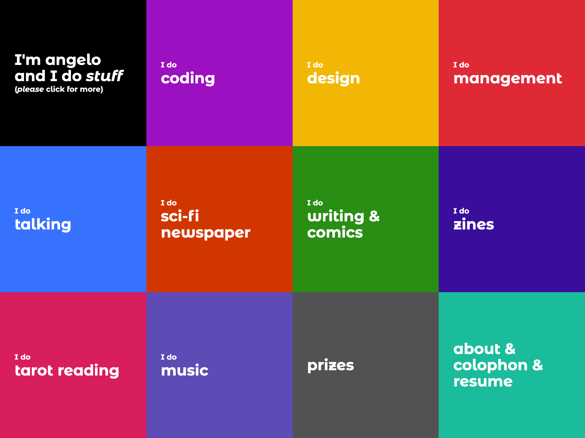

# Angelo Dias's portfolio.

## Description

The [website](https://angelodias.com.br) is self explanatory. 

There's even a [colophon](https://www.angelodias.com.br/about/#colophon).

Made using JavaScript, React, Gatsby, Netlify, VS Code, and more. See [here](https://www.angelodias.com.br/about/#colophon).

## Like what you see?

I'm open for hire.

JS, React, Redux, and more. Hit me on [oiangelodias\[at\]gmail.com](mailto:oiangelodias@gmail.com).

## I want to clone this repo!

Nice, you can do it. Just PLEASE let me know. It took a while to figure out this design and I really like it.

Clone, `yarn` then `yarn develop` (or `gatsby develop` if you have `gatsby-cli`.)

Build and host it using Netlify.