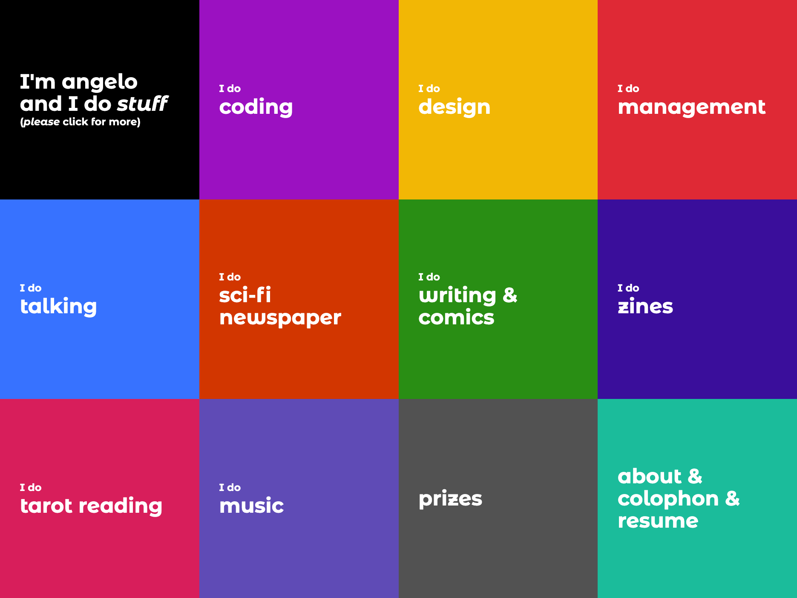

# I will do this **my way**.

I wrote this blog post before the actual blog existed. I chose to do so to commit myself to some ground rules.

This website was and is a place of contemplation and therapy. I call it _portfolio_ because it showcases my work, but getting it to this point was a lengthy exercise of understanding **who I am** and **who I want to be**.

When I mean lengthy, I mean **1-year** of development and weekly therapy sessions.

Accepting myself as the **proud generalist** I am was a painful process, but here I am. I got tired of trying to be what the industry expected of me (and by industry, I mean journalism, design & technology) and started doing things **my way**.

## Design

I really loved the mosaic view my old portfolio had.

I do think it was a great starting point for what I do and also a great way of organizing _stuff_. The downsides? _Clicks, clicks, and clicks_, as well as an inhuman amount of text.

### Form with poor function

When I designed the website, I thought about writing every step of the process of each project, from start to finish, to give my <S>future employers</S> beautiful readers the context needed.

**Man, I was wrong**.

No one read anything and, most of the time, I had to repeat every piece of information about these projects in interviews, which lead to me not wanting to write much about the project themselves, making me end up with pages and pages of a 2-line introduction and a "visit the website" link.

### Form _and_ function

This new approach is focused on getting all the information **fast** and **easy**.

If you open [the homepage](/) on a new tab, you'll see that the amount of texts grows by section. The first one has a few lines. The second, a few more. The last section has a lot more items than the others.

This can lead the user to start reading ("just a few lines") and, if interested in continuing, more information won't hurt their experience.

### Colors

I love high-contrast design. I'm not trying to be in any kind of trend like _neu_ anything, I've been doing this high-contrast stuff for a long time.

So, I built a six-color palette that rotates throughout the website. There are some pages that have pre-selected colors (like the [podcast link](/cronofobia)), while others (like this post) have a semi-random color selection.

I kept the soul of the mosaic version... taking out the mosaic.

## Coding

### Past

When I first built this website, it was poorly done with _create-react-app_.

After some time struggling with it, I rebuilt it using **Gatsby**. At the time, this **JAMStack** stuff was all everyone talked about and Gatsby seemed like a great starting point.

Fact: it was a great starting point.

I needed more, though. And **NextJS** came to the rescue. I (re)rebuilt the website with NextJS and Contentful as a CMS. This was a few months before what you probably read in the design section happened.

A lot of "you need to write here" places without any energy to actually write.

So, I did what everyone should do once in a while: **I gave up**.

### Present

This website is built with:

- NextJS
- MDX
- TailwindCSS

And that's it. No CMS, no i18n, no Storybook, no Notion integration (yep, I did that).

Plain MDX files that get built into this beautiful page you are (hopefully) reading in **Vercel**.

> Instead of using a single room of a huge castle, I built a simple bed and will improve upon that.

### Why not Remix?

I did start developing this new version with **Remix** but their native MDX integration (which, honestly, blew my mind) offers little configuration option. So, I went with NextJS, wishing very much to see the required changes on Remix to make the change.

### Why not bilingual?

Writing in two languages was a burden and, honestly, my target audience can read English (as I'm a developer in the technology market).

I had to drop my mother language Brazilian Portuguese and decided to write only in English. If you want to see me writing and speaking pt_BR, follow my Instagram account 😁
