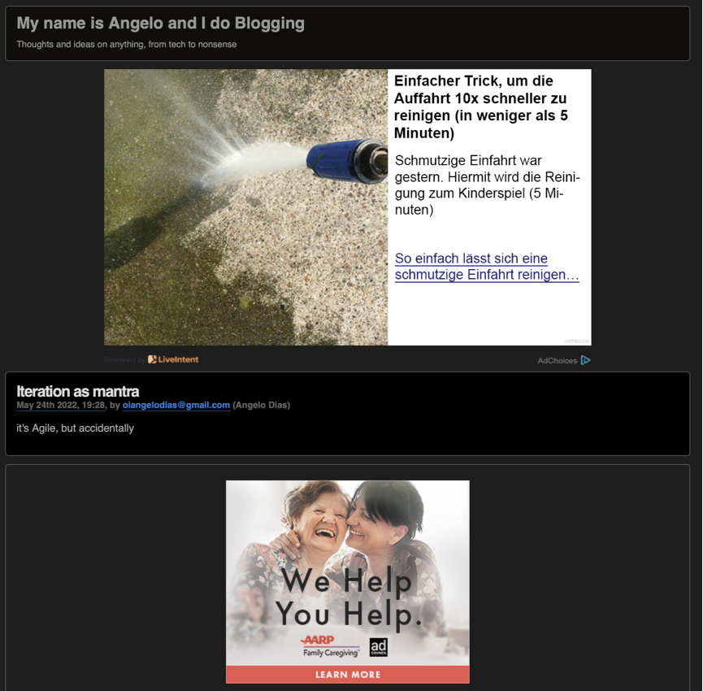

# A quick thing about **subscriptions**

So, I tried this service to add some kind of easy "subscribe to my blog" stuff here and, well, it didn't work properly.

The few people that actually subscribed ended up getting this Ad-filled email in their inbox:

And that's completely unacceptable.

So, I turned this feature off for now and I'm looking for new alternatives.

If you know any, please let me know.
