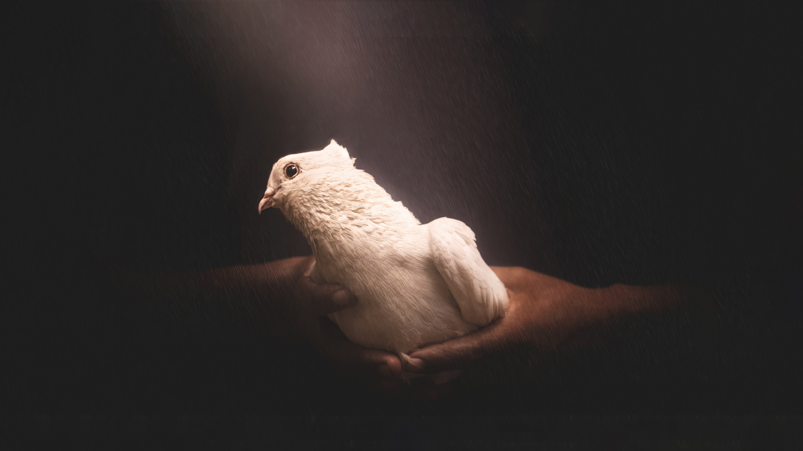
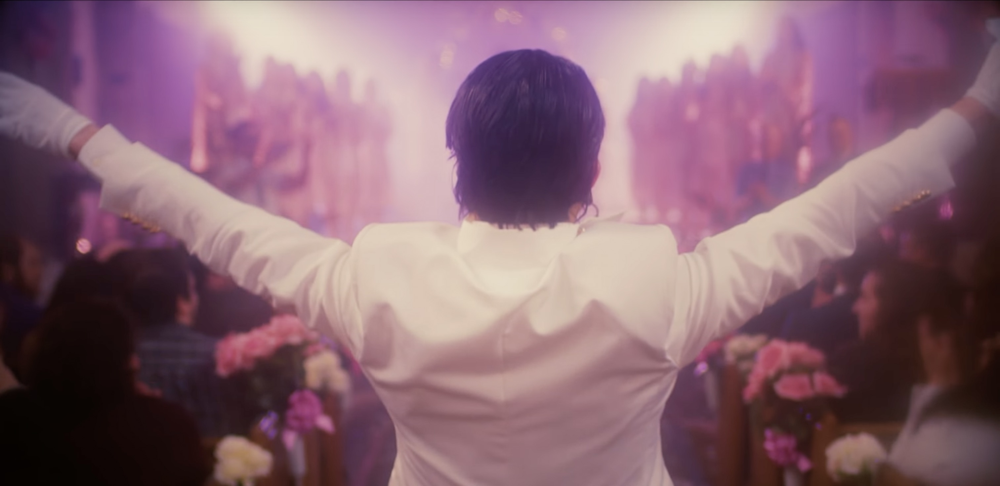

## Genesis

I was Christian for **most** of my life.

Unlike most Christians I know, who only happen to be inside a church for baby baptisms, which are **cute**, or marriages, which are **boring,** I was a full church-every-Sunday goer — with extra Thursday nights and some Saturdays, depending on the month. More than that, I was not only _into_ church, I was a **church musician**.

I'd be there before every worship day, practicing the songs we'd play. Then, during service, we — me (keyboards), dad (electric guitar), my brother (drums), sometimes a very close friend (bass), and the preacher's daughters (vocals) — would **steer the public's emotions** with our playing.

<Parenthesis about="how was service">

We played different kinds of songs. There were the more **joyful,** good for singing and dancing along, as well as those more in the **slow** side, hug-your-brother kind.

Our **special weapon**, though, was this very emotional, spiritual song, every chord and phrase musically touching. The lyrics invited reflection, forgiveness, and **healing.**

A bridge came in: the guitar played differently, the volume got lower, the drums got smoother, and the keyboards (mainly on a pad or strings timbre) did a soothing background for the coming _intercession_.

The singer called for prayer, in spoken word, and **improvised**. They linked the lyrics with their speech, called for shouts and claps from the public, and moved the almost **physical** mass of energy around.

Then, with a pre-defined sign to the musicians, the background sound would get **louder** and **louder**; the drummer started hitting the splash cymbal, the guitarist made his volume higher with each second, and the singer called the whole church for the chorus again, with **all their strength**, from the bottom of their hearts, emptying their lungs, **let's sing together now**, c'mon, I want to hear you!

It was a **spiritual orgasm**.

Any preacher could say **anything** after that. It didn't matter. Our religious cups were filled and our spiritual nerves were tingling. We were ready for any kind of religious message.

</Parenthesis>

## Exodus

Alas, the **fateful** day finally arrived. I was finally touched by the light of **doubt** and gladly **unfound** Jesus, getting free from the shackles of dogma and liturgy. **God Junior** and I are not close friends anymore, but I don't dislike him. We're... **acquaintances.** I'd help to fix his computer, for sure, but I wouldn't lend him money. A colleague, at most.

Amongst **trauma** and **fear**, the church provided me with many good things. For instance, I'm still working hard to find a place with such a sense of **community**, **unity**, and **communion** that's not wrapped in religious thinking.

This is a strong word, **communion**; keep it in your mind.

The church is meant to give you this feeling that you are **part of a whole** — be it the **body of Christ** or a part of the group, the Christians. The former is nice to be in, feeling like you are meant to be there, not just to be, but to act. Be an essential finger, a functioning organ, or a relevant skin stretch.

Of course, there are the obvious **appendixes**, those that are part of without any good reason, or the small pieces of tumors that mess things up more than help, but those are also eligible for god's love.

For instance: specifically in my case, as an evangelical Christian from Brazil (those who know, will know), being converted gave you a **free pass** into any church and its workings. Let us say I got to this new church, and when the service ended, someone came to say hello to me (sometimes they do this out of the blue) and ask me who I am, where I'm from, and simple (**kinda intrusive**) questions. If I said I was already Christian, looking for a new community, or visiting from another, probably I'd get a smile and an "oh **fellow soldier of Christ**, you should come to our [insert theme] special worship on Thursday".

If I said I was not Christian, they would be more careful, and cautious, as I'd be flagging myself as a potential new **convertee**. I met Christians that saw this as some **quota**, a target to reach before going to heaven, like if there was some special **prize** for those who converted more (please, god, if you exist, let there be no prize, just for fun).

So, there was **community**.

**Communion**, on the other hand, means something else, which the church had in abundance. And even though I'm being (maybe too much) sarcastic about Christianity, this is crucial. **Communion is awesome**.

Being at a place knowing you profess the same (or close enough) faith as everyone in that room gives an **unparallel feeling of safety**. We are together, feeling whatever we're meant to feel, without fear or shame of what goes on in our minds at that time. Listening to the preacher say his words, praying together in a high voice, or, especially, during musical worship.

That's what I want to talk about: **I fucking miss musical worship**.

## Leviticus

I did not like being in the church band. I was not too fond of it in some parts of my life. But, seeing those churchgoers smile when I played this specific chord at the start of a song, hearing them **sing in unison**, and the claps at the end — not for us, but for the whole idea of god being there with us — was **moving**. It made me feel not like an appendix, but a liver, a kidney, a **high-traffic artery**. I was an integral part of the body of Christ, doing my best to participate in communion.

After worship, compliments and praises were **rejected**. "No, I didn't play that well today; it's all for god. No, you shouldn't thank me for praise, but god". I need to take this to therapy urgently; I might've found a source for some trauma here.

Being this close to communion, not only as a participant but as a **supplier**, made me... **hooked on it**. I never stopped being part of the church that way. As soon as I got to other kinds of churches, large or small, my brother and I would quickly be siphoned into **The Work**. Not only regular church work — I've been a kids' teacher, a musician, a preacher for teenagers — but any work.

I configured an electronic projection system, typed every song we had into a computer, and set up the software in order for everyone to see the lyrics and **sing along** during worship. I helped set up and tear down weekend camps (something my mother loved to do), cleaned the church building after some special service, and more than once played a part in church theatrical performances.

In plays, I've been Jesus, Satan, a Samaritan, and other parts I can't remember anymore. Communion was part of my life, and I donated myself to it. Of course, I had a personal life, but the church was always a place of **respite and refuge**. I met my first girlfriend (and the second) at church — and we were a full Christian couple, even celibate.

I was — for 13 years — a frequent participant in summer and winter 1-week camps, something not at all Brazilian culture.

## Psalms

I've been to two **concerts** since I came to Germany. Both were **niche bands**, important for a small group of people because of their exquisite characteristics. At the venues, while the bands performed their works of art, the public stood up and **chanted** the lyrics. They accompanied the singer with their voices and the instruments with their gestures. At the chorus, people made **fists** or **signs** with their hands and pointed them at the stage. Some of them had their **flat palms up**, singing the words with their eyes closed, almost like this was... **worship**.

Like in church, the fans were **moved** by the music and felt **connected** to what was being sung, sharing for a moment the experience of being together with fellow **worshippers** — I mean, fans.

The first of these concerts was by **Ghost**, a band known for their catholic satire and songs that look like hard-rock worship music but for the **devil**.

One of my favorite music videos from them is a faithful version of **Christian recruitment material**.

> We're hiding here inside a dream,
>
> and all our doubts are now destroyed
>
> The guidance of the morning stars
>
> will lead the way into the void
>
>  
>
> He is,
>
> He is the shining and the light without whom I cannot see
>
> And he is,
>
> insurrection, he is spite, he's the force that made me be
>
> He is, Nostro dis pater, nostr' alma mater
>
> <Author who="Ghost" what="He Is" />

<Embed youtubeId="7hMaHDTw-pI" />

As the whole concert had a **spiritual theme**, it was hard for me to notice how close that was to **actual** church worship. The closeness to the real thing clouded my judgment, so I needed clarification on what I wished to describe here.

Also, it's hard to have the proper critical judgment in a concert where **zombie Pope** comes out of a coffin and does a **saxophone solo**, right?

<Embed youtubeId="m2Rht5t0dg8" />

A month after Ghost's concert, I went to Prague to watch another favorite band: **Tool**.

And there, yes, I could feel **it** and say out loud: concerts are **Worship**, with a capital W.

I, as an ex-Christian, can say with confidence that the **Holy Ghost was there with us**. Maybe not the "Holy" you believe in, nor the kind of "Ghost" you are thinking of. But some energy was definitely moving us all, worshippers, fans, and the public.

I'm focusing on more than just rock and metal bands. I'm sure a **Beyonce** or **Rihanna** concert is also Worship. Maybe worship of the people they are — strong women with money and respected opinions — or the ideas they share with their songs — freedom, power, independence.

Get enough LGBTQIA+ friends, and you'll understand **Lady Gaga** is some goddess, yes. That's definitely Worship.

My experiences in these two recent concerts showed me how much I missed church worship and how concerts could supply me with this energy I was missing. Seeing a stadium stand up and sing, with full voice, the chorus of Tool's _Pneuma_, was... well, I could say _indescribable_, but hundreds of words describe it, right?

> Reach out and beyond
>
> Wake up, remember
>
> We are born of one breath, one word
>
> We are all one spark, eyes full of wonder
>
> <Author who="Tool" what="Pneuma" />

That's a fucking worship song, man. C'mon.

Slipknot calls their fans **maggots**, which I always thought stupid until now. Understanding this relationship between **gospel** and **secular** music, how the concert ambiance is a replacement of sorts for my lack of religious worship moment, makes me put the **pieces together** and get the whole point of the _maggots_ thing. I don't mind being a maggot as long as I'm in a **crowd of maggots**, singing the hymn of our rebellion, the words of our **emancipation of the traditional**, and the celebration of our worship.

> We fight 'til no one can fight us
>
> We live and no one can stop us
>
> We pull when we're pushed too far
>
> And the advantage is the bottom line is
>
> We never had to fight in the first place
>
> We only had to spit back at their face
>
> We won't walk alone any longer
>
> What doesn't kill us, only makes us stronger
>
> <Author who="Slipknot" what="Pulse of the Maggots" />

## Ecclesiastes

My whole point in this lengthier article than I planned is that **concerts ARE worship**, and they are even a way for me to reconnect with god — whatever you want to call _it_.

A Christian artist I still like very much, João Alexandre, used to sing some non-christian songs in his concerts. He'd sing Gilberto Gil or Caetano Veloso and tell people: "**if this isn't praise, I don't know what is**." He'd sing Moraes & Jobim's Garota de Ipanema in a weird (but efficient) and say: "look the beauty of God's creation."

<Parenthesis about="Stranger Things">

In the Stranger Things season 4 finale, there's a scene in which a metalhead has to play a song to attract some baddies. Before he touched the guitar **I already knew** what song he was going to play (and I bet a thousand thousands knew as well). I'm sure, as well, that his guitar shredding brought joy and hope to the hearts of many watchers. The lyrics had **everything** to do with the main villain, and the probable (and eventual) **martyrdom** of this character brought even more spirit into his performance.

**Isn't god there, somehow?**

</Parenthesis>

Even if the Christian god is not there, there's a **Holy Ghost** floating through every mass of headbangers, the horn-sign-wielding mass of long-haired dudes and leather-clad dudettes. The Holy Ghost also cheers when the **bass drops**and fills our spirit with joy when the solo comes. It makes the makeup stay on, gives energy to the dancers, and **turns sweat into smiles**.

The crowd singing together that **particular** part of the song that helped them go through a **bad patch** in life, even if in completely different circumstances, then **bursting into tears** after shouting the words out loud...

Well, if this is not **praise**, I **don't know** what is.
