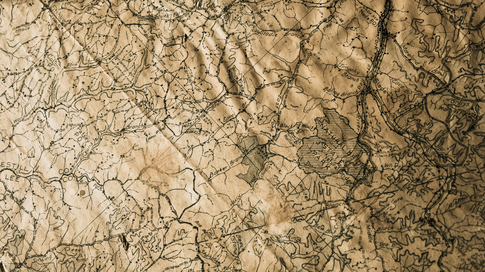
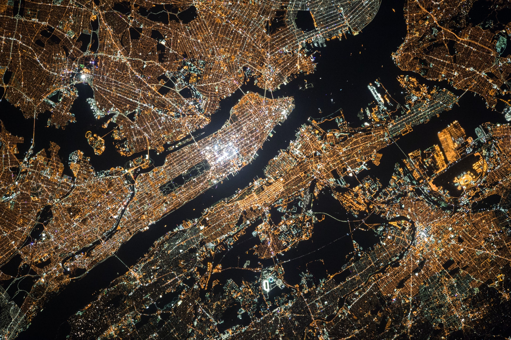
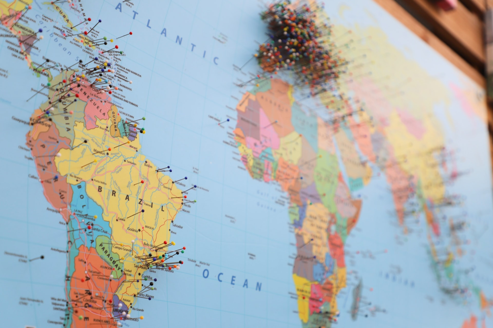
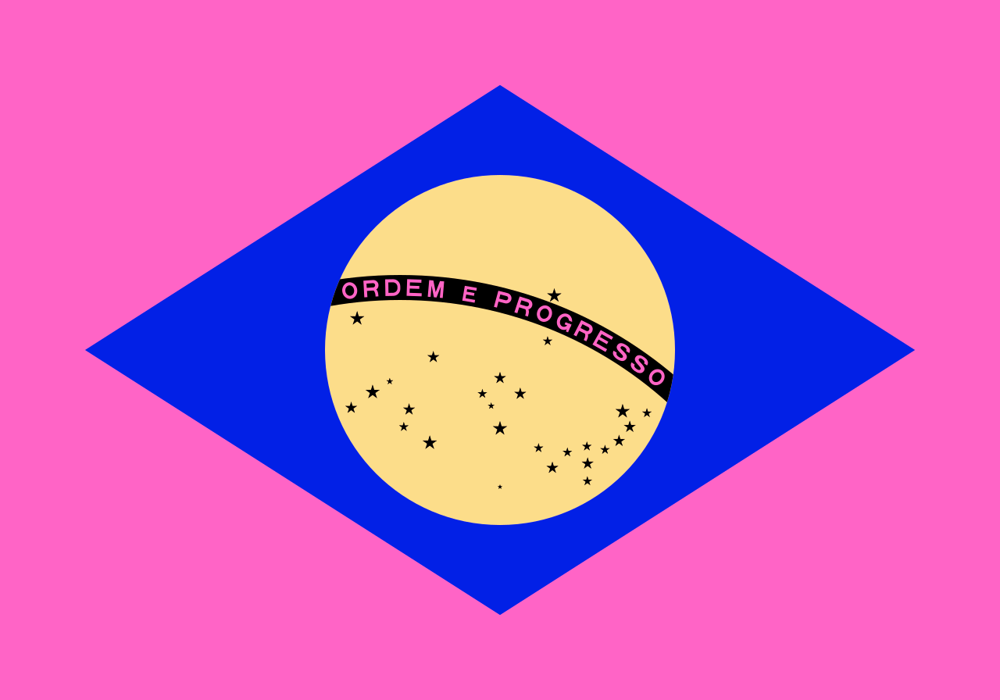

As this website is still **very personal**, I know that only close friends signed up to get updates (you can do it too, subscribe at the end of this article).

I say this because I'd love to tell you this in person, but **I can't**. Is a rather important topic, and I didn't think of a better way to announce this to you all other than writing here for you all to read at the same time.

It's happening since I got to **Munich**, Germany, for work. I felt it weirdly growing inside me. It started to hurt a little but was always a **bearable pain**. The worse part is not the thing itself, but all the implications of it in my life. Even the **political response** to having this makes me feel uneasy.

After you get it, it's forever. There's **no cure**. There's only learning to live with it and making life as comfortable as possible.

I'm sad to announce: **I've contracted patriotism**.

## But, wait for a second

It's _really_ difficult to define patriotism when you are Brazilian. By definition (according to Merriam-Webster dictionary):

> **Patriotism** is the love for or devotion to one's country

But **what is a country**? Is it a piece of land? Is it a place with politically drawn borders? Is it a group of people that, together, share a feeling of origin and belonging?

The answer to that question depends, as in almost any question in the world, from which angle you are looking.

### Nationalism

The original concept of patriotism is tied to the political idea of **Nationalism**, a belief that one nation is superior to other nations. "Nation", by itself, is also a **complicated** term with multiple meanings. For some scholars, a nation can be defined by agreed borders that came to reality after political debate and, most of the time, war. On the other hand, for others, **a nation has no border** other than the reach of its people.

Most of our borders, the ones we see on maps, not in real life, were defined by these people in high places and were drawn with **lots of blood**. Brazilians and others, born in colonized countries, know that their entire nation is built upon the graveyard of many people, **mostly indigenous**. They owned their land way before the white men came with their lust and death.

When you are born inside political borders, **you are issued a nation at birth**. From that moment on, independently if you move countries, continents, or planets, you will always be defined as a part of that nation, that strip of land someone decided to call Brazil, France, or Yugoslavia. Some even go beyond that notion, like the Jew, believing that anyone born from Jew ascendence is a rightful citizen of their country.

That's **definitely not** what I'm talking about when I say "patriotism".

### People's nation

I believe a nation is born with its **people**.

Let's take South Africa as an example. The country has not only been defined by external hands but, inside its borders, got its people separated by the color of their skin in a **horrendous** policy. There are still people in South Africa that descend directly from people that were there before the colonizers came, each own with its language and customs. The South African nation is a known lie among its residents.

A South African out of their country will not hesitate to call themselves South African but will add, most of the time, **their specific ethnicity** to their discourse. Their origin is **sacred** and **important**.

One example of a nation without a country is the **Tartars**, a group of people who originated in Russia — a continental country that is a great example by itself of how stupid borders are. I've met a person that is a Tartar descendant. When we met, she **simplified** saying she was from Russia, soon telling me of her Tartar origin and some of their traditions. In her words:

> "I'm not Russian, **I'm Tartar**. Russia is just the country I came from, but they are not my people."

She told us about how grandparents **warned** their kids not to marry Russian people. They said:

> "A Russian husband will baptize your kids with Russian names, they will not learn our language and they will not practice our customs. You will be treated like a Russian and, in no time, **you will become** a Russian."

According to my interpretation, for them, a person is of their nation when they speak the language and **share their nation's customs**. It's not pure politics that define where you are from, but culture. "You will become a Russian" is a strong phrase for someone that learned, since childhood, that Russians **erased their identity**, their land, and their independence as a nation.

I, then, ask myself:

**Who erased our identity**, stole our land and our independence as a nation, Brazilians?

Of course, I take into account the Portuguese, that stole the land from the indigenous people of South America, but after this was done and our "nation" was born, who came and stole it from us all over again?

## They heard, from Ipiranga, Angelo screaming

These last paragraphs made me stuck for days while writing this article. I wanted to say, in a few hundred words, that our **beautiful**, **colorful** and **original** flag was stolen by a hateful group of fascists, but I won't. There's enough information for you to **do your research** about how Brazil is being the **stage of a coup** that started when Dilma Rousseff was impeached, as well as how we're the perfect playground for **greedy** neoliberalism, making companies richer and people hungrier.

It's understandable, then, to **hate** Brazil while being a Brazilian. The number of people living on the streets in São Paulo, the selling-off of the Amazon rainforest, and the laughable media that supports the government. It's really easy to forget the things we have that are unique, things so common we don't notice.

It's easy and even commendable to **not identify** ourselves with our own country.

> "I cheer against it",
> João Gordo, at Altas Horas TV Show, about the Brazilian soccer team, in 25.06.2022

I found out my patriotism is not the dictionary's "love for or devotion to one's country", but **my love for and devotion to the people**.

### Segregation

I don't see every Brazilian as part of the same country, and I believe you share the same feeling if you come from this beautiful land. It's **impossible** to see ourselves as part of the same group that **supports** the current **clown** (and menace) of a president.

At my job, we even make this joke when explaining Brazilian customs to our coworkers. Me and the other Brazilians, each one from a different state (Goiás, Minas Gerais, and São Paulo), always tell stories about our country. Sometimes they ask us, in a group, what we think about those experiences. "It's a different Brazil", we usually say, when the customs are not something we know about.

So, to accept my patriotism I had to create a **new Brazil** in my head. I had to exercise my imagination and understand that what I missed was not my country, with politically defined borders and a politically screwed up future. In reality, **I couldn't give a single fuck** about this Brazil.

On the other hand, I have a **crushing love** for the people born inside these lines drawn on paper maps.

That might be the reason why I feel like the **Brazilianest Brazilian** ever since I came to Germany. I think there's something in me keeping this flame lit up, this feeling of being part of this special place where **everyone understands me**.

Maybe it's because I see our symbols being stolen and thrashed that I want to do **weekly Brazilian film screenings** at my job. I miss so much our mannerisms, the accent of people from different parts of the country, and the capacity to see **brightness in the darkest moments**, that I want to show them how nice is my country's songs — even though I was never a huge fan of Brazilian music.

**I even apologize to you, coworker**, if I keep bombing you with Brazilian facts and information. That's me trying to not lose touch with this inside me that makes me myself, this part of my personality that comes from being raised where I was. I, **for once in my life**, feel that I am part of something, that I belong somewhere, that **I have a home**. This is completely new to me, so forgive me for my excitement.

Forgive me for my impromptu, improvised patriotism, detached from its original meaning, **resignified** and re-accepted after losing it completely.

This is a big deal for me. I hope we can explore this together.

> "I am so clear about the Brazil that _can be_, that _will be_, that the Brazil that _is_ hurts me."
> Darcy Ribeiro, Brazilian writer, historian, and anthropologist
