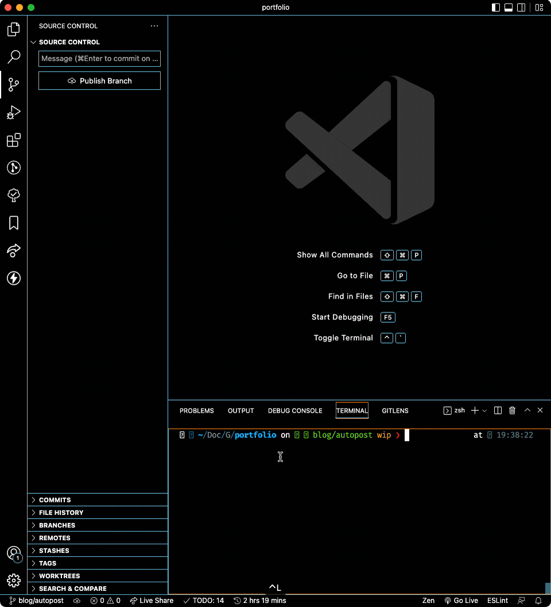

I had to go through the following process whenever I wanted to create a **new blog post** in my blog — powered by **local Markdown** files:

- Get inside the "content" folder
- Navigate to the "blog" folder
- Create a "year" folder
- Create a "month" folder
- Create a "publication" folder
- Add the `md` file with the blog post slug
- Open the `md`
- Open an old, published `md`
- Copy the frontmatter from the old post
- Paste it on the new post
- Clear the data
- Write the metadata
- Update createdAt field
- Start writing

Ugh, that's a **long** (and **boring** list).

This was making me feel not much _programmery_, so I created a **simple script** to automate it. Let's go through it together?

You will be able to do the following at the end of this tutorial:

- Write a CLI command
- Have a `.md` file automatically created
- Have the correct `frontmatter` in this file
- Be in a new `git` branch
- Automatically open `VS Code` (or other) to edit this file

## This tutorial is good for:

- **New developers** that need to lose `terminal` fear
- Anyone who wants to make their workflow **faster**
- People who have locally-hosted MD(X) blogs.

## Setting up the environment

For this small project, you only need to have a project that reads `md` files and that uses `node`. It can be `mdx` or anything else you'd like, honestly. It's not framework specific, so feel free to adapt to your system. My Node version is `v16.14.2` at the moment writing.

Requirements:

- Node
- Node-running project (package.json)
- Yarn (or NPM, your choice)
- **Willpower** and **patience** to research and try/error if something does not match exactly your folder structure and project configuration.

## Concept

Requirements for the script:

- Usable from the **CLI**;
- Two **types** of content (blog or project, in my case);
- Pass the **file name** so the folders and files are created correctly;
- **Automatically** fill `frontmatter` in the new files.

**Pseudo usage**: `{script name} {type} {filename}`

**Example with yarn**:

- Input: `yarn content blog tutorial`
- Output: folders and files for `tutorial.md` are created in the `blog` section, with the `blog` frontmatter.

## Creating the files

At the **root** of the project, I created a `scripts` folder and put a few files we will be using — I prefer to split my code:

- content.mjs
- frontmatter.mjs
- getFilename.mjs
- getToday.mjs
- gitNewBranch.mjs
- openInVsCode.mjs

### .mjs?

This file is not a simple javascript file, it is a javascript **module** (hence the `m`). This makes `node` understand the syntax we are using without the need to compile each file before running it.

Inside the `mjs` is plain `javascript` code, so if your IDE complains about the file extensions, **adapt** this to your usage.

PS: There _might_ be some configuration needed in your project. Do a little **research** if some error show up.

## Main file

Let's build a function and call it at the end of the `content.mjs` file:

```mjs
const newContent = () => {}

newContent()
```

In order to test this, we will use `nodemon` — a tool that runs `node` scripts in watch mode.

I have it installed **globally** using `yarn global add nodemon`, or you can add it to your project by `yarn add -D nodemon`.

In your console, navigate to the **root** of your project and run `nodemon scripts/content.mjs`. You will see the console waiting for you to **save** the file so it can re-run:

```sh
[nodemon] 2.0.19
[nodemon] to restart at any time, enter `rs`
[nodemon] watching path(s): *.*
[nodemon] watching extensions: js,mjs,json
[nodemon] starting `node scripts/content.mjs`
[nodemon] clean exit - waiting for changes before restart
```

## Name and Type

We need to get the file type and name from the CLI (see "Concept", above). `node` gets ,in the `process.argv` property, all that is passed after the script name as items in an array.

So, if I pass `yarn scriptname first second`, I'll get an array with `[node-path, script-path, 'first', 'second']`.

That said, let's add a function to `getFilename.mjs` file and get the filename and type **destructuring** the `process.argv` array.

```mjs
// getFilename.mjs
export const getFilename = () => {
  // Here we omit the two first argument. We don't need them.
  const [, , type, fileName] = process.argv
}
```

We also want to make sure that the script **stops** here if any of these two arguments are not passed:

```mjs
// getFilename.mjs
export const getFilename = () => {
  const [, , type, fileName] = process.argv

  // In my project, I need the type property to match "blog"
  // or "projects" because of the way my folders are organized
  if (!['blog', 'projects'].includes(type)) {
    throw new Error('Invalid type: should be "blog" or "projects"')
  }

  if (!fileName) {
    throw new Error('You need to pass a filename')
  }
}
```

We will need to tell our script **what's the folder** it will save the files we will create in.

Here lies a small **quirk** in `node`. I'm used to getting my directory as `__dirname` in some projects but, by some unknown reason I needed to create my own `__dirname` variable using `fileURLToPath` from the native `url` package, some functions from `path`, and the global `import.meta.url`. This is not the focus of this tutorial, so please just do as I do 🤓

Inside `join` you should put the **relative path** to where you want your files to be saved. In my case, I want them in the `content` folder, then inside a folder corresponding to the type.

```mjs
// getFilename.mjs
import { dirname, join } from 'path'
import { fileURLToPath } from 'url'

export const getFilename = () => {
  const [, , type, fileName] = process.argv

  if (!['blog', 'projects'].includes(type)) {
    throw new Error('Invalid type: should be "blog" or "projects"')
  }

  if (!fileName) {
    throw new Error('You need to pass a filename')
  }

  const __dirname = dirname(fileURLToPath(import.meta.url))
  const contentFolder = join(__dirname, '../', 'content', type)

  return { fileName, type, contentFolder }
}
```

This function returns an object with the **three** necessary variables we need to continue. We will import this function (and destructure it) in our **main** file.

Also, let's include a handy `console.log` to tell us the script is starting.

```mjs
// content.mjs

import { getFilename } from './getFilename.mjs'

const newContent = () => {
  const { fileName, type, contentFolder } = getFilename()

  console.log(`Trying to create a new ${type} content: ${fileName}.md`)
}

newContent()
```

If you save now you should see this message printed in your console.

```sh
[nodemon] restarting due to changes...
[nodemon] starting `node scripts/tutorial.mjs blog filename`
Trying to create a new blog content: filename.md
[nodemon] clean exit - waiting for changes before restart
```

## Date

To create our `md` files in the correct folders, we will get the **current month** and **year** from our `getToday` function. Let's start it.

```mjs
// getToday.mjs

export const getToday = () => {
  const dateObj = new Date()
}
```

We need to get `day`, `month` and `year` from the date object. Let's do it by creating these three variables:

```mjs
// getToday.mjs

export const getToday = () => {
  const dateObj = new Date()

  const month = (dateObj.getUTCMonth() + 1).toString()
  const day = dateObj.getUTCDate().toString()
  const year = dateObj.getUTCFullYear().toString()
}
```

Notes about the code above:

- In `node` `Date`, months start in `0`, so January is not `1`. To circumvent that. we add `1` to the function that gets the month.
- We transform every number to string to **avoid errors** when creating the files and folders.
- Yes, `getUTCDate` is different from `getUTCDay`. We **all** end up learning that one day.

There's a **problem** with the code above: when returning months smaller than October, it returns them with a single digit: `5`. In folder organization, it's best to add a `0` before this so it orders correctly, **avoiding** the following ordering:

- 10
- 11
- 1
- 2
- 3

And **enforcing** this:

- 01
- 02
- 03
- 10
- 11

Let's add a simple helper function that does that for us and return the variables at the end.

```mjs
// getToday.mjs

export const getToday = () => {
  const addZero = number =>
    number < 10 ? '0' + number.toString() : number.toString()

  const dateObj = new Date()
  const month = addZero(dateObj.getUTCMonth() + 1)
  const day = addZero(dateObj.getUTCDate().toString())
  const year = dateObj.getUTCFullYear().toString()

  return [year, month, day]
}
```

I only added the `day` to the above function so you could customize your output. I'm **not** using it, so we'll only destructure `month` and `year` in the main file:

```mjs
// content.mjs

import { getFilename } from './getFilename.mjs'
import { getToday } from './getToday.mjs'

const newContent = () => {
  const { fileName, type, contentFolder } = getFilename()

  console.log(`Trying to create a new ${type} content: ${fileName}.md`)

  const [year, month] = getToday() // <<<<
}

newContent()
```

**Important**: This file will get **quite big**, so I'll try to cut out parts that we don't use from it. Whenever you see `// ...`, it means that the code before or after this sign was **untouched**.

Now, with this data in our hands, we can build our **folder** path, joining all current information:

```mjs
// content.mjs
import { join } from 'path'
// ...

// ...
const [year, month] = getToday()

  const folderPath = join(contentFolder, year, month, fileName)
}

newContent()
```

## Creating folders & files

We split this section into two parts: **folder** and **file**, and there's a reason for it.

### Folder

To create the folders and files in a **safe** way — not overwriting anything — we have first to check if it **exists** and, if not, create them using a special option in `fs`'s `mkdirSync`.

As the name says, `mkdirSync` is a **synchronous** function that creates directories. It can be **recursive**, creating any non-existant directory in a tree.

If I pass `mkdirSync('src/1/2/3/4/5')` and only `src/1` exists, the function will throw an error. But, if I add the `{ recursive: true }` option, it will create all missing folders **without** error.

```mjs
// content.mjs
import { existsSync, mkdirSync } from 'fs'
// ...

// ...
  const folderPath = join(contentFolder, year, month, fileName)

  if (!existsSync(folderPath)) {
    mkdirSync(folderPath, { recursive: true })
  }
}

newContent()
```

First, we check if the folder path **exists**. If it was not created beforehand, it's created now in a **recursive** way.

### File

In order to get the file name, we use the already created `folderPath` variable.

The issue is: what if the file **already exists?** In my use-case, I prefer to **throw** an error instead of overwriting.

Imagine I **accidentally** type `yarn scriptname blog amazing` when I already have a file called `amazing` in this month? I don't want to lose that content (yeah, I'm using `git`, but you get my point).

So, I add a **failsafe** to that:

```mjs
// content.mjs
import { existsSync, mkdirSync } from 'fs'
// ...

// ...
  if (!existsSync(folderPath)) {
    mkdirSync(folderPath, { recursive: true })
  }

  const folderAndFilename = `${folderPath}/${fileName}.md`

  if (existsSync(folderAndFilename)) {
    throw new Error(
      "There's already a file with that name in this month's folder"
    )
  }
}

newContent()
```

## Writing the file

Finally, to (almost) end our struggle, we can **write** the file. We know that:

- The folders are created
- The file name is set
- The file does not exist

We are safe to continue, so let's plop this `writeFileSync` from `fs` there and get **done** with this:

```mjs
// content.mjs
import { existsSync, mkdirSync } from 'fs'
// ...

// ...
  if (existsSync(folderAndFilename)) {
    throw new Error(
      "There's already a file with that name in this month's folder"
    )
  }

  writeFileSync(folderAndFilename, '')
}

newContent()
```

As the **first** argument, we pass the intended file path. As the **second**, we pass what we want written in this file — at the moment, **nothing**.

Voilá. **Done**. We have ourselves an automatic `md` file written in the correct folder for us.

But... that's a little... **not that much**, right? What if we could already populate it with some template?

## Frontmatter templates

In our `frontmatter.mjs` file, we will create an object with our desired **frontmatter**. At the moment, we have two types: `blog` and `projects`, so each will have its own frontmatter.

Another thing we will do with this template is **automatically** set the `createdAt` property filled with... today. My blog uses timestamps, but you can pre-fill anything you want, any way you want.

```mjs
// frontmatter.mjs

export const frontmatter = {
  blog: `---
title:
createdAt: ${new Date().getTime()}
description:
tags: []
---

Write here
`,
  projects: `---
title:
description:
createdAt: ${new Date().getTime()}
tags: []
image:
  src:
  alt:
---

Write here
`,
}
```

The spacing is weird **on purpose**, make sure it has no whitespace before each line to avoid **errors** in your frontmatter.

Now, on our main file, let's pass this new information to our `writeFileSync` function — with a little `console.log` telling everyone of our **accomplishments**:

```mjs
// content.mjs
import { existsSync, mkdirSync } from 'fs'
// ...

// ...
  writeFileSync(folderAndFilename, frontmatter[type])
  console.log(`${fileName}.md created succesfully!`)
}

newContent()
```

> But Angelo, what happens if we pass a `type` that doesn't match the object?

**We won't**! Remember that this function throws an **error** if you pass any type other than `blog` and `projects`!

## Finale (?)

**This is the end** of the main part of this tutorial.

But there's more to be done, because we are developers and we are absolutely **lazy**!

Our computer is doing all of this by itself and we still have to create a branch in git for this new file, and navigate to it **manually**, like the Aztecs? Oh no, not today.

## Auto git-branch

In `gitNewBranch.mjs` file, we will write a simple function using the powers of `simple-git` package. There's nothing much to be said here: if you understand `git` a little bit, you will be able to decypher the following code with ease.

But, before, **install** the package using `yarn add -D simple-git`.

```mjs
// gitNewBranch.mjs

import { simpleGit } from 'simple-git'

export const gitNewBranch = async (type, fileName) => {
  console.log('Creating branch and commiting...')
  await simpleGit()
    .checkout('main')
    .checkoutLocalBranch(`${type}/${fileName}`)
    .add('./*')
    .commit('Add starter MD')
}
```

**Important**: see the little `async` in the first line? Yeah, `simpleGit` is **asynchronous** so we will use `async/await` here to make it work **perfectly**.

Before the `simpleGit` function, plop that `await` there.

We need to make two changes in our main function: add an `async` flag and add `await` before calling the `gitNewBranch` function:

```mjs
// content.mjs
import { gitNewBranch } from './gitNewBranch.mjs'
// ...

//...
const newContent = async () => {
  //...

  // ...
  console.log(`${fileName}.md created succesfully!`)

  await gitNewBranch(type, fileName)
}

newContent()
```

## Opening VS Code

To **finalize** our script, we will command our terminal to open the file in our **favorite** IDE — in my case, VS Code.

This is the **most obfuscated** of all of the files. It takes advantage of `exec` from node's `child-process`. It's **hard** to read and to explain. What it does is simple: it runs in your terminal whatever you pass on the `exec` first argument.

We will use the `code` command, as if we were opening a file from our **terminal**. If something goes wrong, an **error** will be logged.

```mjs
// openInVsCode.mjs
import { exec } from 'child_process'

export const openInVSCode = pathAndFileName => {
  exec(`code ${pathAndFileName}`, (error, stdout, stderr) => {
    console.log(stdout)
    if (error !== null) {
      console.log(stderr)
    }
  })
}
```

Yeah, I know, **not** the best file. But, if you can open `code` using your terminal, you can also use it this way. We will add it to the **end** of our main file:

```mjs
// content.mjs
import { openInVSCode } from './openInVsCode.mjs'
// ...

// ...
  await gitNewBranch(type, fileName)

  openInVSCode(folderAndFilename)
}

newContent()
```

And that's it!

## Package.json

I **promise** this is the last step! I swear!

We will add two scripts in our `package.json` to make this even **easier**.

```json
  "scripts": {
		// ...
    "post": "node ./scripts/content.mjs blog",
    "project": "node ./scripts/content.mjs projects"
  },
```

This way, when we `yarn post tutorial`:

- Our script will create a folder with today's year and month
- It will add a `tutorial` folder
- Inside it, it will create a `tutorial.md` file
- It will populate this file with `frontmatter.blog` content
- It will create a new branch in `git` and checkout there: `blog/tutorial`
- It will open VS Code for you to write your file.

Want proof? There you go.



## Finale!

<CTA
  href="https://github.com/angelod1as/portfolio/tree/main/scripts"
  content="See the source code in this website's repo"
/>

That's all of it.

Thanks for reading and let me know if you end up implementing this.

**Don't forget to share this post with everyone!**

Final content of our main file:

```mjs
import { existsSync, mkdirSync, writeFileSync } from 'fs'
import { join } from 'path'
import { frontmatter } from './frontmatter.mjs'
import { getFilename } from './getFilename.mjs'
import { getToday } from './getToday.mjs'
import { gitNewBranch } from './gitNewBranch.mjs'
import { openInVSCode } from './openInVsCode.mjs'

const newContent = async () => {
  const { fileName, type, contentFolder } = getFilename()

  console.log(`Trying to create a new ${type} content: ${fileName}.md`)

  const [year, month] = getToday()
  const folderPath = join(contentFolder, year, month, fileName)

  if (!existsSync(folderPath)) {
    mkdirSync(folderPath, { recursive: true })
  }

  const folderAndFilename = `${folderPath}/${fileName}.md`

  if (existsSync(folderAndFilename)) {
    throw new Error(
      "There's already a file with that name in this month's folder"
    )
  }

  writeFileSync(folderAndFilename, frontmatter[type])
  console.log(`${fileName}.md created succesfully!`)

  await gitNewBranch(type, fileName)
  openInVSCode(folderAndFilename)
}

await newContent()
```
