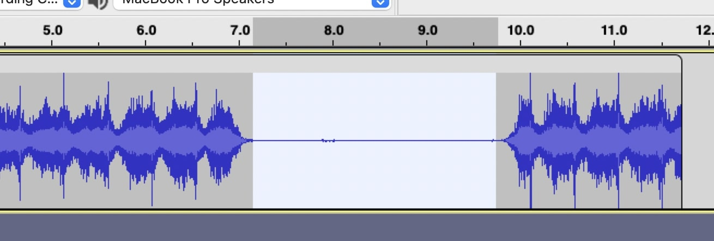
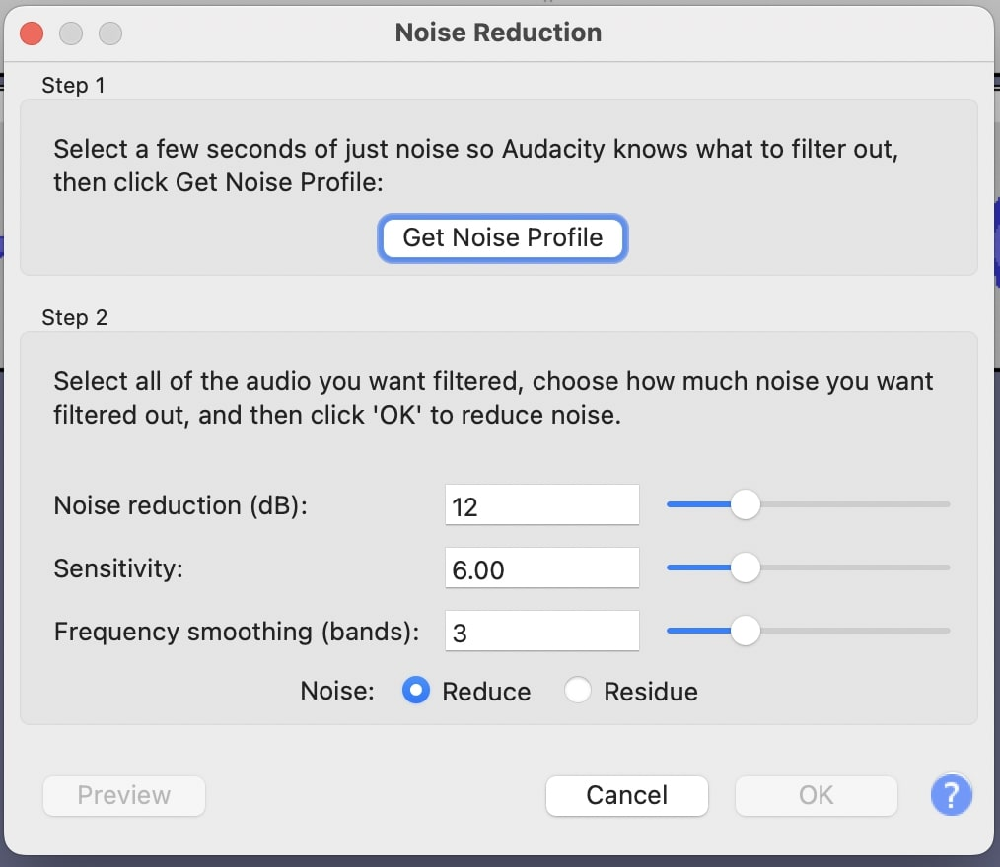
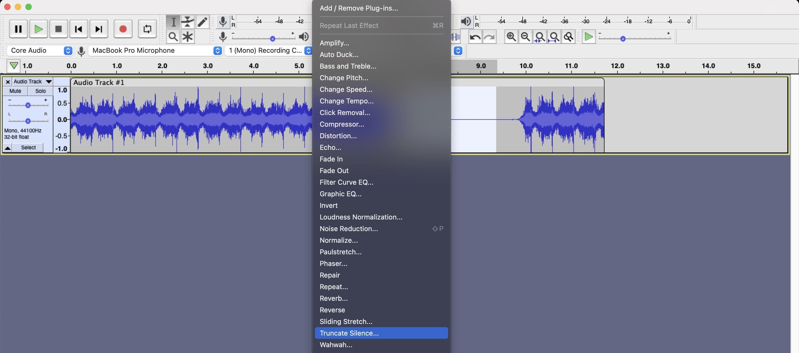
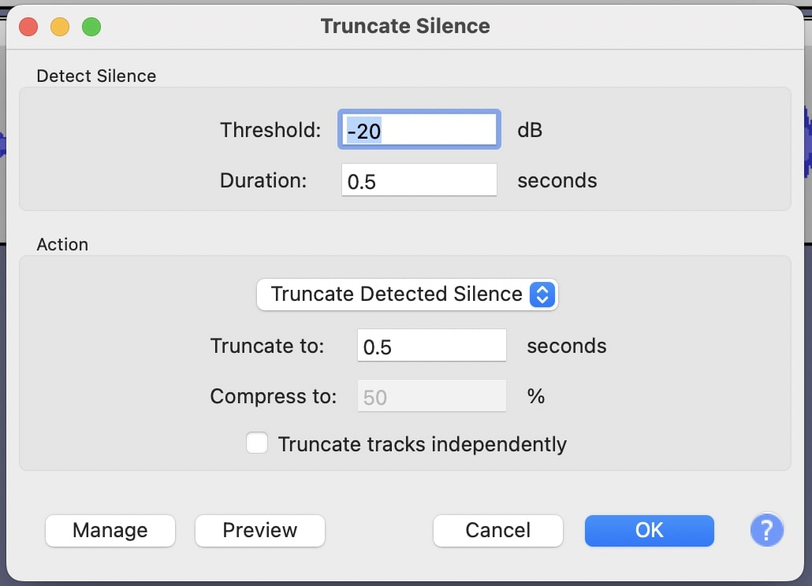

At the moment of this writing, I'm **closing my [daily podcast](/podcast)**. With almost **400 episodes** (and a few bonuses), this has been a crazy ride and I am going to talk about its **emotional entails** it in a different post.

This one is a **tutorial** on how to make **your own daily podcast**.

The topics I'll cover are:

- [Motivation](#motivation)
- [Pre-production](#pre-production)
  - [Equipment](#equipment)
  - [Script](#script)
- [Production](#production)
  - [Setting](#setting)
  - [Recording](#recording)
- [Post-production](#post-production)
  - [Editing](#editing)
  - [Publishing](#publishing)

## Motivation

There are a **lot** of reasons to do a podcast, especially a daily one. We've been **overwhelmed** by all kinds of publications in audio style — from Youtube 4h long unedited interviews to intricate and **perfectly built** weekly audiodramas.

So, whenever you think why to throw your ideas in an already saturated world, **STOP THINKING**. Go with the flow. **Write first, edit later**.

This topic isn't about thinking if your motivation is enough for starting such project, it's to **motivate** you to go do it -- and to hell with the nonbelievers.

If we were talking about **drawing,** the weekly, well edited and full of effects podcast would be a **fine painting**. Daily podcasts are gesture drawing, **quick jots** on the paper resembling a sillouette.

In music, a daily podcast is a **riff,** while more complex podcasts a fully **produced** song. In film, an Instagram **story** vs a short-lenght **movie**. In writing, a **note** vs a third-draft **short story**.

I think you got the point.

### Catharsis

Of course this is my **particular view** on the daily podcast.

For me, it is a media for expression and **testing.** It's ok to not know exactly what you are talking about, to open yourself to **vulnerabilities** and to not reach a lot of people.

In my opinion, if you are moving a heavy production, fully scripted and edited, pre-ready, larger body of work you are splitting in daily bits and publishing... well, it's still a _daily podcast_, but not **my view** on daily podcasts.

Go out there and do your daily podcast, put your ideas out and make it happen, as **shittier** as it might be in the **beginning.**

### It's recorded

The only _no-go_ I can warn you about is simple: it's a **recording on the internet**. It's very hard to _unrecord_ things and unpublish them after they've been online. So, if you are making a daily podcast and telling to whoever listens your opinion on a subject, **expect backlash**. People are mean on the internet and they _will_ **critique** a thousand times before the first compliment comes.

Remember that everything you put online is **hardly ever deleted**. Someone, somewhere, will have your downloaded file, a backup of something shameful you'd rather not have said.

On the other hand, if you are feeling good about your opinions and want to **stick with them**, be my guest. You can always publish a mea-culpa podcast later — but these reach only **10% listeners** of the original polemic episode.

## Pre-production

### Equipment

**STOP.**

Close that Amazon tab. Do not — I repeat: DO NOT — browse Ebay for used professional microphones. Take your hand **out** of the keyboard and put you credit card back in your wallet, you **don't need** that fancy software.

Crisis averted, we can start by the beginning: you do not need new equipment to record **any** podcast, especially a daily one.

I assume you have a **smartphone.** Even if you don't, the good and old flip phones from the 2000 already came equipped with audio recording capabilities. You **do not need** a professional microphone costing hundreds (or thousands) of your local currency. **Use what you have at hand first**.

This is a common **rookie mistake** (and by rookie I include myself). We all love **shiny new things** and they are widely available. Most of them are either crap or absolutelly amazing. Either way, **unnecessary**.

If you have a cellphone, you **already** have a **great microphone** in your hand.

Recording audio is much more about **set and setting** than the actual microphone quality. Having a **quiet environment**, without echo, is more than enough to start your daily podcast experience

### Script

**STOP.**

No, this time I'm **kidding,** it's completely OK if you want to script your daily podcast, but... well, good luck. It will be **way more** demanding than doing it from the heart.

I know many of you really want to do a better job than just an audio-format journal, with you blabbing about stuff for a few minutes and that's all. The problem is that script brings **two issues** that are hard to come around.

**First**, you need to write the actual script. Sitting down and writing is not as easy as it looks like, especially because writing demands **editing** — and that's a completely different monster. You will write a phrase that sounds great in your mind but, at the time of recording it might sound weird. So you'll want to **edit** it. After a few hours, you will notice a simple 10 minutes episode became an essay of 40 minutes that you took **3 hours** to complete.

**Second**, you will probably read your script while recording and that's not only something the listener **can recognize**, it's also **boring**. It's weird to listen to people reading from perfectly crafted text, and even **weirder** when they try to add spoken interjections in the text for the actor — in this case, you — to read.

That's why real actors do **out-lout script-reading sessions**. They can hear what each other says and adapt as they go, with the scriptwriter or director, to make it more natural and better for the listener/watcher.

I discourage scripts in daily podcasts because, in my opinion, they take a lot of the **spontaneity** off.

As I said before, for me this activity is meant to be **cathartic**, artistic, experimental. It's nice to do weird stuff sometimes, but most of the times you will have **not much time** and no one other than yourself to judge the quality of your work, and we're **awful self-editors**.

Try not scripting and **see how it goes**. Don't let you be your own judge, publish it even if shitty and keep **going until** you find your style.

On the other hand, I **do recommend** having some kind of theme before you start recording. In my experience, for instance, I asked listeners to add anonymous questions to a special website and I answered them while recording. It was not a proper script, but it was a **heading** I could follow so I'd not lose my track and could know when it was **time to end** the recording.

## Production

### Setting

What do you need to record a daily podcast in terms of setting:

#### A quiet place

It can be your room, or **your car**. The important part is: make it **quiet but not empty** — the more furniture, the better, especially cloths and foams (like sofas or beds). This reduces echo a lot. A car is nice because, well, it’s mainly a couple of **sofas on wheels**.

If you don't have a quiet place or you are a minimalist living in a 100 square meters room with just one mattress, you will need to **improvise**. A colleague from Folha de S.Paulo newspaper started recording professional podcasts **inside his closet** — quiet, full of cloth, zero echo. He was also gay, so this was a common joke he’d tell friends about coming out.

DO NOT BUY EQUIPMENT FOR THIS. **Improvise**, cover yourself with a blanket, record under the bed, _do your jumps_.

#### Software and Hardware

You, of course, did not buy equipment for this, **following my tips**, right? So all you'll need is some recording app in your phone. Any will do — independent of brand of phone.

There are tons of **free** ones and even, depending on the phone, **native** audio recording software.

If you can (and want) to get a **little bit** more technical, look for apps that record in `wav` and not `mp3`. The latter is a compressed format and it is not so easier to _save_ later if something does not sound good. Remember, though, that nothing can save a badly recorded audio.

After you recorded in your phone, I recommend using a **free** audio editing software like [**Audacity**](https://www.audacityteam.org/). It comes in many languages (although I recommend English, I'll explain later) and it has **a lot of tutorials** on how to use it online, both in text and video.

There are a lot of great, professional podcasts, that started in Audacity. I started my podcast on Adobe Audition (when I had an Adobe subscription) and changed to **Audacity** without regret. It's a great — although a little clunky — piece of software.

> "But Angelo, I want to record using my laptop, not my phone"

That's OK. Audacity handles recording, editing, mixing and exporting. It's a good bet, I assure you, and also keeps **your money in your pocket**.

### Recording

So, you got some themes written down, charged your laptop, got your recording app ready and put some **whisky** in the kids milk so they'd be quiet. It's time to **sit and push the record button**.

You can do this in two ways:

- Record **daily**, edit daily, publish daily
- Record a **week's worth** of podcasts, edit them in batch and schedule publishing.

I've tried **both** and will give you my impressions.

#### Daily everything

It's really nice to record **a podcast a day**, having the subjects really fresh in your mind. It's also, a **daily chore** you have to commit to.

I started my podcast doing that: at the end of every day I'd get my laptop ready for recording and would produce a **5 minutes** episode. This took, usually, **45 minutes** each night.

45 minutes: finding a **quiet place**, readying the equipment (a laptop and a microphone I had from old adventures), starting the recording app, doing the **actual recording**, listening to see if everything was OK, proper editing, exporting, uploading, writing info about the episode on the publishing website, and finally sharing in social media.

If you have this kind of time and **energy to spare**, this is the best way to do it. Also, your listeners will know they'll have a **fresh episode** every morning waiting for them.

I didn't have that energy, so I moved on to...

#### Batch production

Every Sunday, I'd get my equipment prepared to record at least **7 episodes** — a weeks worth. That way, I could spend less time setting up equipment, could block a time on my calendar I'd be **100% invested** in the recording and could have some social life during the week.

This worked **like a charm** — especially because I had the themes pre-written. I'd list them and know what those episodes were about, then **just recorded them all**, one after another.

After that, I'd start the most time consuming time of the process: **editing**. At least I'd be in an editing mood, and doing it over and over again made processes faster. I was learning the editing software better and knowing how to use with more agility.

The **publishing** part also got easier and faster: I'd open the website **once**, upload all files, write the episode information (copying and pasting what would repeat) and schedule the episodes, **one for each day**.

After the 3rd season, though, I **stopped scheduling** like that and just published a batch of episodes at Sunday night (as I realised this made little diference for the readers). Again, **it's all about energy**: if you have it for scheduling, do so. If not, no judgement.

## Post-Production

### Editing

There are **two ways** to do this:

- Do it **yourself**.
  - It's going to take time. A lot.
  - You will learn new a new skill.
  - You'll be able to boast "I did this myself"
- Hire a **professional** to do it for you.
  - It's going to cost money. A lot.
  - If you have the bucks, I highly recommend [Felipe Gomes](https://fegomespodcast.com.br/), my go-to podcast editor. He was responsible for _Capotes Marrons_ and some episodes in _Cronofobia_ (especially _Hospício Lotado_ series)

Really, you should **do it by yourself**. Editing this kind of podcast, especially with the tools we have on our hands, is easy-peasy. It takes a lot of time to get used to it but, when you get the hang of it, you'll **do it in no time**. Kind of _any new skill in the world_.

Sure, you can pay someone to do it for you, but most of the podcast editors I know (and I know **a bunch**) don't take that kind of job because of the **high context-switching** they need to do. Most of them have costs that start in the 30 minutes mark, and you'll be doing 5/10 minutes episodes. It's **not worthy** for most of them to charge less and it's not great for them to change the way they work because of you and your **special project**.

So, from now on, I'll presume you will edit it **by yourself**.

#### Do it yourself

Important: I **don't know** the right names for stuff. I do this as a hobby, so I don't care about the difference between _editing_ and _mixing_. I don't care if it's a _filter_ or an _effect_. If you want to **correct me**, [submit a pull request with the corrections](https://github.com/angelod1as/portfolio).

Again, there are two ways of doing this.

- Manually
- _Magically_

By manually I mean this workflow I used to do:

- Add the recorded file to Audacity
- To avoid destructive changes (see below):
  - Duplicate the track
  - Mute and lock the first track
  - Start working on the duplicated track
- Apply effects and filters
  - Noise gate to avoid background noise
  - Noise reduction effect to remove more background noise
- Go through the file, removing pieces I don't want, cutting silences short and removing "ummm" and "aaaas".
- Apply more effects and filters
  - Normalizer to _make it sound better_
  - Compressor to _make it sound better_
  - Filter Curve EQ _make it sound better_
  - Bass and Trebble to _make it sound better_
  - Limiter to avoid peaking audio
- Save the project
- Export as WAV

<Parenthesis about="destructive changes">

You should **avoid** destructive changes in **any** piece of software you work.

The concept is simple: if you open a file, change that file, and overwrite it (**not** being able to **recover** the original version), that's a **destructive workflow**.

A few softwares **don't** have destructive flows. They, instead of saving the new state of the file over the last one, save a list of **commands to apply**. That way, the original audio file is kept untouched in the file system, and every time you open the software file, they re-apply the commands to the original audio file and show you the result. This way you can always come back to the original if you do something wrong.

Audacity, sadly, is kind of a destructive edition software. It **does not** change the origin WAV if you imported it from somewhere else, but it does destroy the file if you recorded straight into the software. So, I always do this when working with Audacity-recorded audio:

- First, I select the original track
- Then, I duplicate it (Edit > Duplicate)
- Then, I mute the first track and deselect it (just click outside of the track, or click in the "select" button in some other track)
- Lastly, I make sure the edits I'm doing are happening only in my duplicated track.

That way, if I ever need to **rollback** to the original version, it's there, muted and saved.

Remember: always avoid destructive changes --- in softwares and in life, if possible.

</Parenthesis>

As you probably can see, I have **no single clue** why I do most of that. These steps were recommended by colleagues to _**make it sound better**_, so, I don’t know exactly what each thing does. That will be also **your journey** into discovery: finding what effects make your voice sound better.

As I was repeating this task **a lot**, I decided to come up with the second way to do it.

#### Magic!

Audacity has a feature called **Macros**. It's basically a tool that lets you record commands and play them by hitting a **single button**.

It's possible, for instance, to record a boring, **repeated behavior**, and just play it in every file you have.

Do you see where I'm going?

This whole process I described before is done with **minimal difference** between runs. It's almost perfect for **automation**, as the variables **hardly change**.

Of course, I take into account that the audio will be recorded with the same **amount of silence**, the same **microphone**, the same **host voice**. Knowing I record in my living room with my own voice makes this process **very possible**.

I, differently than Brazilian Mr. M., will teach you how to **do magic** yourself. I'll even share my **recipe below**.

I have two Macros configured in my workflow: `Duplicate.txt`:

```txt
SelectAll:
Duplicate:
MuteTracks:
ShiftDown:
TrackMute:
SelTrackStartToEnd:
Macro_Podcast:
```

and `Podcast.txt`:

```txt
Save:
Noisegate:attack="100" decay="300" gate-freq="0" hold="50" level-reduction="-24" mode="Gate" stereo-link="LinkStereo" threshold="-40"
NoiseReduction:Use_Preset="<Factory Defaults>"
TruncateSilence:Action="Truncate Detected Silence" Compress="50" Independent="0" Minimum="0.3" Threshold="-40" Truncate="0.3"
Normalize:ApplyGain="1" PeakLevel="-0" RemoveDcOffset="1" StereoIndependent="0"
Compressor:AttackTime="0.2" NoiseFloor="-40" Normalize="1" Ratio="2" ReleaseTime="1" Threshold="-5" UsePeak="0"
FilterCurve:f0="20" f1="98.323265" f2="234.18214" f3="500" f4="997.72628" f5="2945.5193" f6="22050" FilterLength="8191" InterpolateLin="0" InterpolationMethod="B-spline" v0="-21.619049" v1="0.095237732" v2="-1.8095245" v3="0" v4="-0.28571701" v5="3.5238094" v6="5.4285717"
BassAndTreble:Bass="5" Gain="0" Link_Sliders="0" Treble="0"
Limiter:gain-L="0" gain-R="0" hold="10" makeup="No" thresh="-0.1" type="HardLimit"
ExportWav:
Save:
```

As you can see from these files, they are just a **bunch of commands** for the software to follow. I split it up for personal reasons, but this could be on a single file without any issue (it's nice, though, to show you can make different Macros and call them from other Macros by using `Macro_{NAME OF MACRO}` command, like in the end of `Duplicate.txt`).

As some of you are not programmers or audio enthusiasts, I'll teach you how to work with **Macros** using Audacity graphical user interface. Easier to do, but a little clunky. Let's do my workflow together.

#### Know my origins

First of all, I'm using **Audacity 3.1.3** on a Mac. This is important, as features might change places in different versions — although the macros are here since a long time so I bet you won't have problems with them.

#### Speak my language

Another important thing is: use Audacity **in English**. I suppose that, by reading this text, you know English enough to work in the software. My reason, though, is because this guide will use **English commands** and **English-titled tools**. Sadly Audacity doesn't follow a very simple guideline in programming:

> Translate your UI, not your code

Then, when exporting/moving the Macros from an English Audacity to, let's say, a Brazilian Portuguese one, most Macros are **lost in translation**.

#### Read the map

I could explain step-by-step how Macros in Audacity work, but their official docs do it way better than I would ever do.

So give a shot at them and **visit their documentation** clicking below. It's not a lenghty read and it will give you the info to better understand what I'm saying here.

<CTA
  href="https://manual.audacityteam.org/man/manage_macros.html"
  content="Go read the official docs!"
/>

Basically, what you need to do is simple: **chain commands** that you would usually repeat _ad-infinitum_ in a Macro and use it instead of them.

#### Hold my hand

I, for instance, always **clone my track** after recording so I can practice _non-destructive editing_ (see above chapter). This Macro, below, is somewhat in plain English (you can even copy it and paste it in the Macros folder — search the wiki for the location in your system — just remove the last line):

```txt
SelectAll:
Duplicate:
MuteTracks:
ShiftDown:
TrackMute:
SelTrackStartToEnd:
Macro_Podcast:
```

From start to finish:

- Select all tracks (usually, one)
- Duplicate it
- Mute all the tracks
- Select only the track down (the duplicated one)
- "Click" the mute button (they were all muted, so it's going to unmute it)
- Select track from start to end
- Apply the Macro called "Podcast"

This is already a good deal of repetitive work I'm not doing. It saves me a lot of time already.

#### Auto-editing

In all of my workflow, this is the **most mindblowing one**. This one saves me HOURS of work.

Instead of manually cutting **every single weird silence**, I use Audacity `truncate silence` tool to do it for me. It, as the name says, **removes the silences** and **glues** the remainders together.

To make sure my silences are actually silences (and not low-humming noisy backgrounds), I use the `noise reduction` effect. In order to use it, you select **a part of your track** that has only **background sound** (it's nice even to record just the background, with no voice, for a few moments just to be able to get a good sample later)



Then, click on `Get Noise Profile` button.



That means that the software will use this audio **as sample of what's noise**. Anything that goes over it its not noise, but content.

Eyeball the numbers in the dialogue (more on this in the next section), test and undo if it sounds **robotic**. Remember: **nothing saves a bad recording**, so focus on getting it clean before getting to the editing table.

You might need to apply noise reduction **twice** to see silence appear.

After doing that, apply the effect `Truncate Silence`:





Again, I have **absolutely no idea** what those numbers mean. Eyeball it and make sure Audacity is not cutting your voice, but **only silence**.

#### Polishing & treatment

If you remove `Noise Reduction` and `Truncate Silence`, all the other things that happen in my Macro are **very** unknown to me.

This is the **hardest part** of all the process, in my opinion. I find it so difficult to make my audio less _recorded inside a bathroom_ and more _professional_ that I asked some friends that work in this business to tell me what I needed to do in order to make it **sound better**.

Then, I turned their advice into the Macro I showed before.

So, I'm truly sorry for not being able to give step-by-step explanations on why I chose 10 over 20 in some configuration. I'd love [some PRs](https://github.com/angelod1as/portfolio) in this article, if you end up knowing what I am talking about.

Go out there, ask friends for help, ask Reddit, ask Google.

#### Too shallow but still wet

Summarizing a lot, what I do in my Macro is:

- Make sure I don't have any clipping parts (Noisegate)
- Reduce noise (NoiseReduction)
- Truncate silence (TruncateSilence)
- I have no clue what this does (Normalize)
- I have no clue what this does (Compressor)
- Make my voice sound more deep and without too much treble (AKA: I have no clue what this does) (FilterCurve)
- Wait, hadn't the last setting edited my bass and treble already (_I have no clue what this does_ strikes back) (BassAndTreble)
- This limits the highest volume to a threshold (so it doesn't sound too loud on some parts and not that much in others) (Limiter)
- Export file as `wav`
- Save file.

#### From start to finish

After recording, I simply select the part that's _background noise_ and run the Macro.

That's it.

**I don't do anything else**: no more editing, no more cutting, nothing.

If any setting went wrong and made my audio sound like shit, I simple `ctrl-z` and run the Macro again. I rarely have to micromanage and change Macro settings on the fly.

That's another face of the _make this fast, make this stupid_ mindset of daily podcasting.

### Publishing

When you get your little, pretty podcast **ready for consumption**, you'll need to upload it somewhere so it can actually reach people, right?

There are **several ways** to host a podcast, but this far in the process you might be tired, so it would be better if _someone_ did that for you, right?

Well, I'd like to introduce you to [Anchor](https://anchor.fm/)

This _could_ be a sponsored post, but **it's not**. Anchor just... does everything needed. And it's easy to use.

You need to create an account there, which will be **attached to your podcast** (so, multiple podcasts = multiple accounts), and start uploading your files.

They offer a **lot of good things for free**, like the possibility to broadcast your podcast to **Spotify** (the company that owns Anchor). It's possible to broadcast to **Apple Podcasts** and **Deezer**, but that takes a little more work (and you can find a bunch of tutorials on how to do that online).

The best thing about Anchor is their **ease of use**. It's really simple to update an audio, add a background music, even record and edit straight in the app is nice — although not perfect.

There's not much more to be said. Anchor is **the best current option** for podcast free hosting and publishing.

### Conclusion

This half-baked guide is the best I could do while not getting too technical.

I hope this can **steer your creative process** and not make recording your daily podcast another **really boring chore**.

I'm sorry about the lenght and the lack of details. Please hit me up on twitter, instagram or telegram (at the bottom of this page) for comments and updates. If you want to add information here, [submit a pull request or open an issue](https://github.com/angelod1as/portfolio). I will love to add your comments and information to the article and, obviously, tag you as the source.
