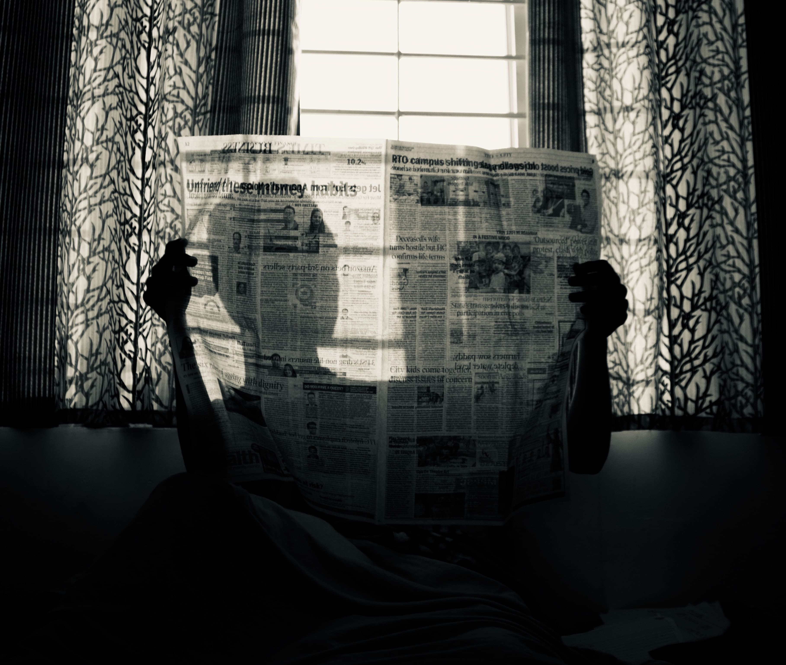

_Fade in_.

Imagine the **top of a mountain**. A dry one. No snow, no rain, nothing. Rocks, sand, stone.

Actually, **you are there**, wearing a dress. Yeah.

In your hands you have one of the mountain stones. It has a strange shape, like if it's a **tablet** of some sort.

From the sky, a weird light comes down. It has the form of a **finger,** and it comes down towards you in a strange motion, ghostly, dancing, almost... **divine**.

It touches your tablet and your long hair and beard (independent of gender, a beard is necessary here) get blown by the wind on top of the mountain.

There, on that tablet, a **single commandment** is written. One phrase, written by God's hand (finger, actually), in plain _insert your language_. It's written:

> You shall not optimize your time.

You get down from the mountain and see your people worshipping an idol, made of gold, in the format of a **clock.** They tear their clothes off, scream, and run around like a bunch of ants in search of a lost anthill. They are praying to this false god in search of time gone that will never be reclaimed.

This time won't **ever** come back, it's true, but this worship won't help anything.

You raise your voice and, as the prophet of that people, do what prophets do best: **increment** god's words with your own.

> Repeat chores. Do round trips. **Don't multitask**.
>
> Postpone. Turn down. Give up.
>
> This feeling that everything is time consuming, every minute needs to be invested, every second has to be **useful**. That is going to kill you.
>
> Do things at your own pace, really.

You go around, tablet in hand, telling people the **holy words** you learnt from the holiest him(her/them)self.

> Take time for yourself and **rest** when rest is due.
>
> Don't use free time to do more, and more, and more.
>
> Earn enough to pay the bills. Have a damned **budget**.

You see a man looking at his a cellphone, furiously typing, sweat falling from his brow, stress coming out of his pores. It's **saturday**, for god's sake!

You punch his phone away, and with the voice of the all powerful, you say to his face:

> Overworking **hurts** you and your colleagues.
>
> Overtime makes work **look** easier, while what happens in reality is that more work is done in **unaccounted time**, so no one knows how much time a task actually takes.

You go towards a woman in a labcoat, handling glass utensils in a research table (what is it doing in this village? You don't know), doing some kind of experiment. You take her protective glasses off and tell her the **truest truth**:

> Time is meant to be **savored**, not to be optimized.
>
> It's not **stretchable** or **compactable**, independently of what Einstein says.
>
> In real life, time passes just like that, with **no clear measure**.

You point to the golden clock, ticking and ticking and ticking without stop.

> The numbers of the clock are **lying** to you!
>
> They are meant to be constant! But, aren't they, in reality, showing time in **variable rates**?
>
> Don't you always look at the clock and say "oh my god, it's already past my time"?

People are coming around you, no longer distressed because you interrupted their pagan rituals, or because you punched _certain phones_ to the ground. They are **curious**. They want to hear your message — even though they still look cautious.

You ask them to gather closer. You smile — and even without much teeth, you are charming.

_(What? You are a desert prophet, of course you have lost some teeth. Do you think they have dentists in some far-away mountain? Or that god is going to lend you his toothpaste (colgod? Sorry) to you? C'mon, don't loose track. Let's continue.)_

You call a woman to the front of the crowd. You put your hand on her shoulders and say, looking at her eyes:

> Stop what you are doing right now and **feel your heartbeats**.
>
> Are they fast or slow?
>
> **Breathe**.

She goes back to the crowd, her hands resting on her chest.

You point to an attentive man and continue your speech.

> Look around and **listen** to other people's conversations.
>
> Take those earphones **off**.
>
> Pry, eavesdrop, read whatever your neighbor is writing on their phone.

The phone guy interjects but you pay no attention. Your hands move with energy, following your speech.

> Do **silly stuff** or spend a **whole day** under the sheets — just remember to tale a walk to nowhere once in a while.
>
> If this is difficult to you — as it is to me — come up with a **silly goal**.
>
> "Today I'll have a coffee in this far place just because I want to" and walk there.

You make a hand movement that, to you, looks like water falling from above. For everyone else, it looks like a thousand other things. You are not good in mimicry, they realise.

> Deadlines are always **waterfalls**, remember this.
>
> What is needed from you at the 10th, is needed by your boss at the 5th, and by their boss at the 1st.
>
> Delay what's necessary.

You take a deep breath. People around you listen closely. They are captivated, interested, but still not convinced.

> Be late, be early, be on time, on **your time**.
>
> Handle with the consequences and **remember**:
>
> This is not a manual, just a way of living that we've all forgotten

You do something untinkable. You smash the stone tablet on the ground, into a thousand pieces, and hear the shouts of the people, in ecstasy and awe of your discourse.

The golden clock makes a deep sound. It signals that an hour has passed.

Everyone — you included — realise break time is over, so they go back to work. Those reports won't deliver themselves by tomorrow morning, right?

At least you are wearing a nice dress.

_Fade out_.

## Intermission

PS: This was never meant to be written in this narrative way, but, yeah, this is what few glasses of wine and a pipe with good tobacco can do to a writer.

## Not today

When I worked at the newspaper, we had this jargon we used when we realised we wouldn't be be able to finish everything on time.

**"It won't print"**, we would shout to our colleagues when another change was demanded from management, when the articles doubled in size and the pictures needed to be cut or replaced.

**"It won't print"**, we said quietly between ourselves, full of anger and stress, when people acted out of hierarchy and not reason.

We would work furiously — we, layout designers, were the funnel of the whole operation — and send the pages to the printing company at the last possible second.

**"It won't print"**, we would shout.

But, regardless to our omens, **it always print**.

We would dream about the rebellious day in where it would actually **don't print**.

A day where things really went crazy and our work, as fast as it could be, couldn't be finished.

A day were the journalists didn't have the final version of their articles, the pictures were not treated properly, the bosses finally stopped cursing and started throwing punches.

This day never came, it always print.

**It will print** almost always, so take your time. Everyone can shout, and scream, and throw blame. It will print and another day will come, with another batch of fresh newspaper to be done.

Praying for the clock to regain lost time **is lost time**.

## Recommendation

The main character of the movie [Cashback](https://www.imdb.com/title/tt0460740/) (2006) can stop time. He does that, strip people and draw them.

Yeah, it's creepy, but it's an awesome movie that sometimes bring some nice discussions about time.

For instance, what's your strategy to make time pass faster? And slower?

They talk about that in Cashback.

<Embed youtubeId="DmiDoPP72hg" />
