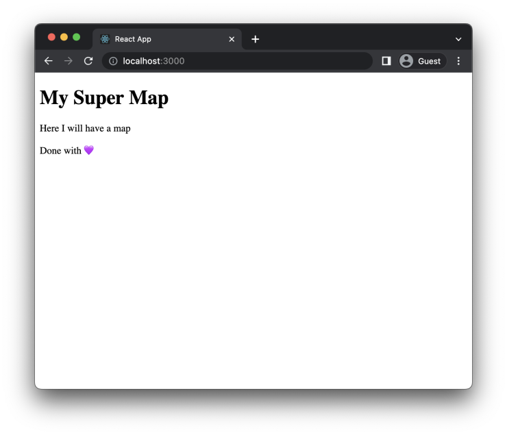
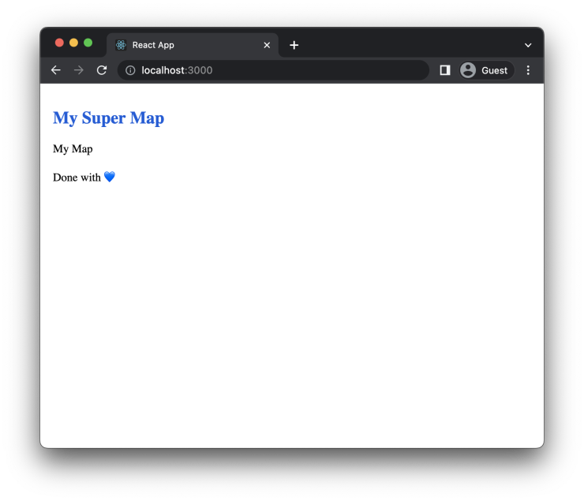
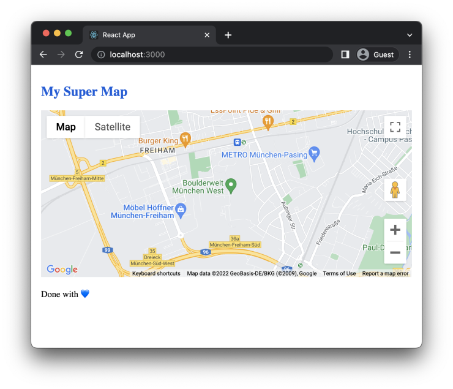
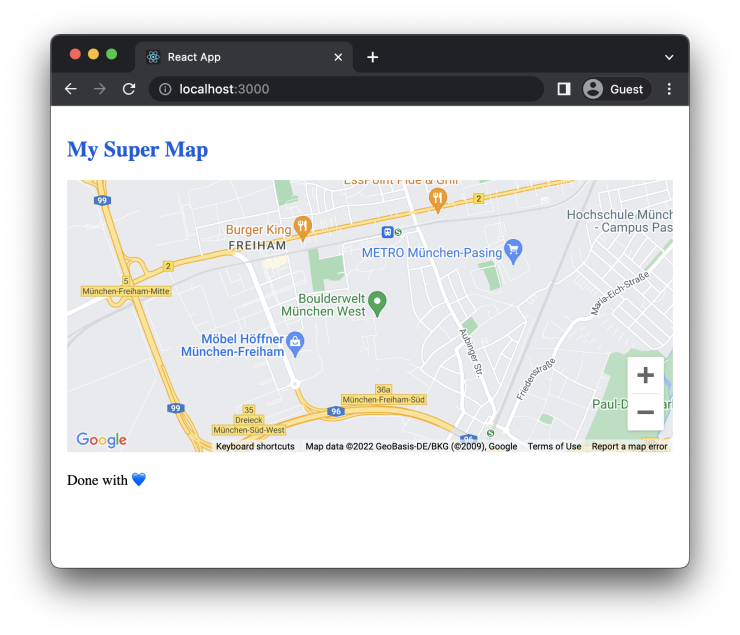
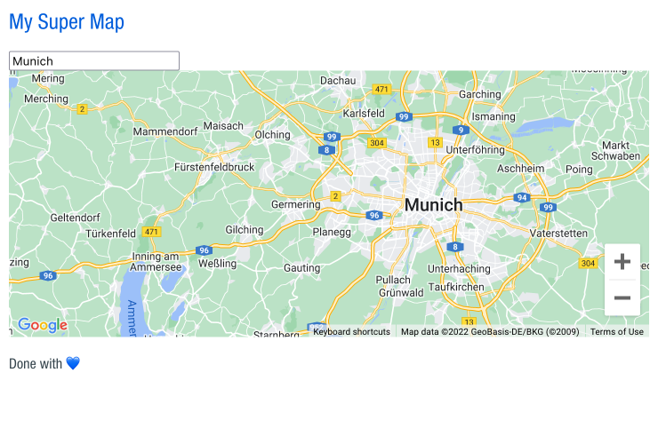
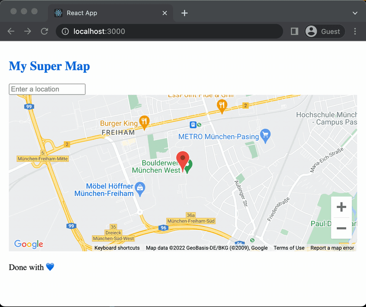

This is a short tutorial on how to successfully implement Google Maps using a handy library created by Google's own Developer Relations Engineer @jpoehnelt and maintained by the community.

We'll have a map with a search and a location marker by the end of it. All using the native Google Maps API with the help of @googlemaps/react-wrapper.

## What you will need:

- Basic React knowledge;
- [A Google Maps API key](https://developers.google.com/maps/documentation/javascript/get-api-key).

[If you want to see the finished project, the code is available in this repository.](https://github.com/angelod1as/google-maps-with-search)

## Why this library?

If you visit [the library documentation](https://github.com/googlemaps/react-wrapper), you won't see much. It has a simple and straightforward example showing how to render a map in your app.

Under the hood, though, it has two very important characteristics:

- It loads the Google Maps script only **once**, independently of how many maps (or other Google Maps API-related tools) you want to render.
- It makes `window.google` available in every child component of this wrapper.

Using its `render` strategy, it's even possible to show a loader when the script is not loaded yet.

## Implementing the code

### From zero...

To start our little Maps adventure, we'll create a simple component:

```ts
// App.tsx
export const App = () => (
  <>
    <h1>My Super Map</h1>
    <div>Here I will have a map</div>
    <p>Done with 💜</p>
  </>
)
```



Awesome, what might seem like a boring page with no content... is also a fertile field for ambitious creation!

### Installation

First, add the library to your project:

```
yarn add @googlemaps/react-wrapper
```

If you use Typescript (I do!), also add the types:

```
yarn add @types/google.maps
```

If you don't do Typescript — _you should_ — this tutorial is harder to copy-paste but simple to follow up. Just ignore the types 😁

### Here comes the wrapper

The library tells us to add a `Wrapper` component to our code to load Google's API script and render the map. Let's do it in a separate `Map` component.

(I'll also add some CSS to this page, but you don't need to do the same, ok?)

```ts
// App.tsx
import { Map } from './Map'

export const App = () => (
  <div style={{ padding: 10 }}>
    <h1 style={{ fontSize: 24, color: 'rgb(0, 93, 219)', marginBottom: 20 }}>
      My Super Map
    </h1>

    <Map />

    <p style={{ marginTop: 20 }}>Done with 💙</p>
  </div>
)
```

```ts
// Map.tsx
import { Wrapper } from '@googlemaps/react-wrapper'

export const Map = () => {
  return <Wrapper apiKey="API_KEY" />
}
```

This `Wrapper` is very important: it takes as props the `apiKey` and, in this example, a `render` function.

The unknown magic here is that you can call this `Wrapper` as many times as you want, and **the Google Maps API script** will only be **loaded at the first call**. This saves us time, processing, and money.

PS: You can't call different instances with different API keys. You'll get a console error if you try to do this.

Did you notice I mentioned a `render` prop but didn't use it in the last example? Well, here it comes:

```ts
// Map.tsx
import { Wrapper, Status } from '@googlemaps/react-wrapper'

const render = (status: Status) => {
  switch (status) {
    case Status.LOADING:
      return <div>Spinner</div>
    case Status.FAILURE:
      return <div>Error component</div>
    case Status.SUCCESS:
      return <div>My Map</div>
  }
}

export const Map = () => {
  return <Wrapper apiKey="API_KEY" render={render} />
}
```

The `render` function is simple and pratical: we can render different components depending on the status of the script loading.

I won't focus on the `LOADING` and `FAILURE` states in this tutorial, though. Use your imagination and build a beautiful loading spinner and an informative error page.

### Where's the map?

So far, our page looks even more boring than before:



We still need another component to render the actual map with all its configurations. Introducing the MapComponent:

```ts
// MapComponent.tsx
import { useEffect, useRef } from 'react'

export function MapComponent({
  center,
  zoom,
}: {
  center: google.maps.LatLng
  zoom: number
}) {
  const ref = useRef<HTMLDivElement>(null)

  useEffect(() => {
    if (ref.current) {
      new window.google.maps.Map(ref.current, {
        center,
        zoom,
      })
    }
  }, [])

  return <div ref={ref} />
}
```

- The `MapComponent` component accepts two required props:
  - `center`, an object with `latitude` and `longitude`;
  - `zoom`, a `number`.
- We create a `ref` and pass it to a simple `div`;
- When the component renders for the first time, our `useEffect` calls the Google Maps API constructor and builds a new `Map` instance.
  - We pass the `ref` node to it (that's why we check if it exists in the `if` clause)
  - As the second parameter, the `options` object is passed with the supplied `center` and `zoom`.
  - PS: If your linter complaints about `useEffect` needing more props in its brackets, _kindly ignore them_. We only want this to run **once**.

### Things are getting real

Now, we need to update the parent component to pass the correct properties down the tree.

Here is where the fun actually begins: at this moment, we can access `window.google` and use the whole Google Maps API, because the `Wrapper` from the library makes sure the API is loaded and ready.

For instance: when passing `center`, we could use the API constructors to build us the object we require:

```ts
// Map.tsx

// ...
const render = (status: Status) => {
  switch (status) {
    case Status.LOADING:
      return <div>Spinner</div>
    case Status.FAILURE:
      return <div>Error component</div>
    case Status.SUCCESS:
      // These are the coordinates of our beautiful office, in Munich
      const center = new window.google.maps.LatLng(48.136297, 11.419739)
      return <MapComponent center={center} zoom={14} />
  }
}
// ...
```

This will create the `center` object with correct types and all.

> _"But Angelo, this is a silly example, as center is just an object with two properties. I could just write it, no need for this fancy constructor."_

Yes, little grasshopper, you are correct. This, though, is a simple example of accessing the API constructors and using them for virtually **anything** the API provides.

Want to do a marker? Use the API constructors. A route? API constructor. A search? Well, guess what?

### The only required CSS we're going to write

If we look at the page we're building, we'll see a beautiful... nothing.

For the map to be displayed, our `div` needs a fixed height. Doing so, the Map wrapper will render using the entire available space:

```ts
// MapComponent.tsx
return <div style={{ height: 300, width: '100%' }} ref={ref} />
```

And that's the only CSS you will write to make this map happen. Refresh your browser, and look what's there:



### Tweaking the map

You have a fully working map in your app, with the correct behaviour of any Google Map instances you see around there.

This is a lot... and I want less.

So let's use [Google Maps API](https://developers.google.com/maps/documentation/javascript/controls) to disable some stuff that's cluttering our map.

```ts
// MapComponent.tsx

//...
new window.google.maps.Map(ref.current, {
  center,
  zoom,
  fullscreenControl: false,
  mapTypeControl: false,
  panControl: false,
  streetViewControl: false,
})
//...
```



That's more like it! Following the Google Maps API, I could turn off any feature I didn't want on my map.

### So far, so good.

At this moment, we have a perfectly working map in our app.

So, if _after the storm comes a calm_, let's add some **storm** to our lives.

### Adding a Location Search

Remember our main `App` file? Let's add a new component there:

```ts
// App.tsx
import { Map } from './Map'
import { Search } from './Search'

export const App = () => (
  <div style={{ padding: 10 }}>
    <h1 style={{ fontSize: 24, color: 'rgb(0, 93, 219)', marginBottom: 20 }}>
      My Super Map
    </h1>

    <Search />
    <Map />

    <p style={{ marginTop: 20 }}>Done with 💙</p>
  </div>
)
```

Let's create a new `Search.tsx` component so we can handle everything location-related there.

This component will be very much like the `Map.tsx`: a `Wrapper` and a `render` function.

```ts
// Search.tsx
import { Wrapper, Status } from '@googlemaps/react-wrapper'

const render = (status: Status) => {
  switch (status) {
    case Status.LOADING:
      return <div>Different Spinner</div>
    case Status.FAILURE:
      return <div>Different Error component</div>
    case Status.SUCCESS:
      return <div>My location search</div>
  }
}

export const Search = () => {
  return <Wrapper apiKey="API_KEY" render={render} libraries={['places']} />
}
```

Notice, above; we have two main differences from the `Map`:

- A slightly different `render` function. We can, with this, have additional loading and error components without calling the Google Maps API script again. Remember? **The Wrapper only calls it once**.
- We define an extra library for the API to load: `places`. That will be used in our next file.

Important: you should add your libraries to **every call** of the wrapper component, so we'll update that on the `Map.tsx` file as well.

PS: If you are messing with Google Maps API for the first time, you need to know there are some API parts you have to allow on their console for this to work. They have different pricing , so be careful with what you do and read their docs thoroughly.

### Search and you may find

One great Google Maps API tool is the `Autocomplete` widget. It automatically renders a search bar for us without the need for too much configuration or even UI building. It's not the most beautiful, but it works.

Let's implement it in our brand new `SearchComponent`:

```ts
// SearchComponent.tsx
import { useEffect, useRef } from 'react'

export function SearchComponent() {
  const ref = useRef<HTMLInputElement>(null)

  useEffect(() => {
    if (ref.current) {
      new window.google.maps.places.Autocomplete(ref.current, {
        types: ['geocode'],
      })
    }
  }, [])

  return <input ref={ref} />
}
```

You can see that we're setting the type of search for `geocode`. which, to keep it simple, means: search addresses, cities, and PO-boxes, and you will get an answer.

If you want to, we can filter even more our search parameters. Let's limit the search only to Germany.

```ts
// SearchComponent.tsx

//...
new window.google.maps.places.Autocomplete(ref.current, {
  types: ['geocode'],
  componentRestrictions: { country: 'de' },
})
//...
```

Looking at our app now, we can search for a myriad of places but this results in no change in our map, right?


That's why the received value from the `Autocomplete` is not being used anywhere.

### Putting things together

Let's put the _reaction_ in this _React_ application.

In our `App.tsx`, we're going to handle a `coordinates` state and pass it down to our `Map`. The `setCoordinate` we'll pass it down to our `Search`.

In summary: the search will update the map's coordinates.

Quick info on `Coordinates` type: when we create an object “by hand”, Google sees it as a `LatLngLiteral`. When we create it via the constructor, it's assigned a `LatLng` type. The main difference is that the latter has more information than just `latitude` and `longitude`, but we won't go that far in this tutorial.

```ts
// App.tsx
import { useState } from 'react'
import { Map } from './Map'
import { Search } from './Search'

export type Coordinates = google.maps.LatLngLiteral | google.maps.LatLng
export type SetCoordinates = (coordinates: Coordinates) => void

const defaultCoordinates: Coordinates = {
  lat: 48.136297,
  lng: 11.419739,
}

export const App = () => {
  const [coordinates, setCoordinates] =
    useState<Coordinates>(defaultCoordinates)

  return (
    <div style={{ padding: 10 }}>
      <h1 style={{ fontSize: 24, color: 'rgb(0, 93, 219)', marginBottom: 20 }}>
        My Super Map
      </h1>

      <Search setCoordinates={setCoordinates} />
      <Map coordinates={coordinates} />

      <p style={{ marginTop: 20 }}>Done with 💙</p>
    </div>
  )
}
```

We'll start with the Map and MapComponent, setting them to receive the coordinates and update accordingly.

```ts
// Map.tsx
import { Wrapper, Status } from '@googlemaps/react-wrapper'
import { Coordinates } from './App'
import { MapComponent } from './MapComponent'

const render = (status: Status, coordinates: Coordinates) => {
  switch (status) {
    case Status.LOADING:
      return <div>Spinner</div>
    case Status.FAILURE:
      return <div>Error component</div>
    case Status.SUCCESS:
      return <MapComponent center={coordinates} zoom={14} />
  }
}

type MapProps = {
  coordinates: Coordinates
}

export const Map = ({ coordinates }: MapProps) => {
  return (
    <Wrapper
      apiKey="API_KEY"
      render={status => render(status, coordinates)}
      libraries={['places']}
    />
  )
}
```

The above `coordinates` come, by default, with a fixed location. We pass it to `center` as it's going to be the first coordinates rendered.

Then, in the MapComponent, we add an useEffect to recenter the map with the `coordinates` change (no need to recreate it, right?):

```ts
// MapComponent.tsx
import { useEffect, useRef, useState } from 'react'
import { Coordinates } from './App'
import { Marker } from './Marker'

export function MapComponent({
  center,
  zoom,
}: {
  center: Coordinates
  zoom: number
}) {
  const [map, setMap] = useState<google.maps.Map | null>(null)
  const ref = useRef<HTMLDivElement>(null)

  useEffect(() => {
    if (ref.current) {
      const newMap = new window.google.maps.Map(ref.current, {
        center,
        zoom,
        fullscreenControl: false,
        mapTypeControl: false,
        panControl: false,
        streetViewControl: false,
      })
      setMap(newMap)
    }
  }, [])

  useEffect(() => {
    if (map) {
      map.setCenter(center)
      map.setZoom(zoom)
    }
  }, [center, map, zoom])

  return (
    <div style={{ height: 300, width: '100%' }} ref={ref}>
      {map && <Marker coordinates={center} map={map} />}
    </div>
  )
}
```

**OK. Done. Now, to the second part, starting with the Search:**

```ts
// Search.tsx
import { Wrapper, Status } from '@googlemaps/react-wrapper'
import { SetCoordinates } from './App'
import { SearchComponent } from './SearchComponent'

const render = (status: Status, setCoordinates: SetCoordinates) => {
  switch (status) {
    case Status.LOADING:
      return <div>Different Spinner</div>
    case Status.FAILURE:
      return <div>Different Error component</div>
    case Status.SUCCESS:
      return <SearchComponent setCoordinates={setCoordinates} />
  }
}

type SearchProps = {
  setCoordinates: SetCoordinates
}

export const Search = ({ setCoordinates }: SearchProps) => {
  return (
    <Wrapper
      apiKey="API_KEY"
      render={status => render(status, setCoordinates)}
      libraries={['places']}
    />
  )
}
```

`SearchComponent`, on the other hand, is more complicated. Come with me, step by step:

- The user searches for a new location, chooses a selection, and confirms (by a click or an enter)
- Our `Autocomplete` instance receives from Google Maps API a lot of values about the selected place. Each value incurs a different cost.
- To avoid overbilling, we'll limit the results only to what we need: the latitude and longitude to pass to our `Map`. This, in API lingo, is `geometry`.
- Then, we should use the API mode of getting the data: through a listener.
  - we `get` the place information from our Autocomplete;
  - we find the `lat` and `lng` values
  - we set the `coordinates` with these new values if they exist.

UGH, it looks a lot, right?

Maybe with the code things will get easier. See below:

```ts
// SearchComponent.tsx
import { useEffect, useRef } from 'react'
import { SetCoordinates } from './App'

type SearchComponentProps = {
  setCoordinates: SetCoordinates
}

export function SearchComponent({ setCoordinates }: SearchComponentProps) {
  const ref = useRef<HTMLInputElement>(null)

  useEffect(() => {
    if (ref.current) {
      const autocomplete = new window.google.maps.places.Autocomplete(
        ref.current,
        {
          types: ['geocode'],
          componentRestrictions: { country: 'de' },
        }
      )
      // Here we set the only field we want back from Google, reducing cost
      autocomplete.setFields(['geometry'])
      // Here we add the listener, specifically to the event "place_changed"
      autocomplete.addListener('place_changed', () => {
        // Here we get the returned place
        const place = autocomplete.getPlace()

        // Put lat and lng into consts to make it easier to read
        const lat = place.geometry?.location?.lat()
        const lng = place.geometry?.location?.lng()

        if (lat && lng) {
          // Return if they exist
          return setCoordinates({
            lat,
            lng,
          })
        }
      })
    }
    // No need for any dep here, as the listener is set by Google Maps API
  }, [])

  return <input ref={ref} />
}
```

```ts
// SearchComponent.tsx
import { useEffect, useRef } from 'react'
import { SetCoordinates } from './App'

type SearchComponentProps = {
  setCoordinates: SetCoordinates
}

export function SearchComponent({ setCoordinates }: SearchComponentProps) {
  const ref = useRef<HTMLInputElement>(null)

  useEffect(() => {
    if (ref.current) {
      const autocomplete = new window.google.maps.places.Autocomplete(
        ref.current,
        {
          types: ['geocode'],
          componentRestrictions: { country: 'de' },
        }
      )
      // Here we set the only field we want back from Google, reducing cost
      autocomplete.setFields(['geometry'])
      // Here we add the listener, specifically to the event "place_changed"
      autocomplete.addListener('place_changed', () => {
        // Here we get the returned place
        const place = autocomplete.getPlace()

        // Put lat and lng into consts to make it easier to read
        const lat = place.geometry?.location?.lat()
        const lng = place.geometry?.location?.lng()

        if (lat && lng) {
          // Return if they exist
          return setCoordinates({
            lat,
            lng,
          })
        }
      })
    }
    // No need for any dep here, as the listener is set by Google Maps API
  }, [])

  return <input ref={ref} />
}
```

Now, if you go to our app and do the search again, it will hop to the correct place.

### You are here

There's still one more thing that we can do here to make our app even better.

When we search for the location, there's nothing to tell us exactly where's what we search for. We have a general idea of a center, but that's it.

Let's add the final component of this exercise: the `Marker`.

```ts
// Marker.tsx
import { useEffect, useState } from 'react'
import { Coordinates } from './App'

type MarkerProps = {
  coordinates: Coordinates
  map?: google.maps.Map
}

export const Marker = ({ map, coordinates }: MarkerProps) => {
  const [marker, setMarker] = useState<google.maps.Marker>()

  // Creates an empty Marker when component mounts
  useEffect(() => {
    if (!marker) {
      setMarker(new google.maps.Marker())
    }
  }, [])

  useEffect(() => {
    if (marker) {
      // remove the marker if the coordinates doesn't exist
      if (!coordinates?.lat && !coordinates?.lng) {
        return marker.setMap(null)
      }

      // Updates the marker
      marker.setOptions({
        map,
        position: coordinates,
      })
    }
  }, [coordinates, map, marker])

  // The component returns null as google.maps.Map manages the DOM manipulation.
  return null
}
```

Step by step:

- The `Marker` needs to receive the `map` instance
- we set a `marker` state to hold the instance created in the first render. It's an empty marker, with no options, on purpose.
- Whenever we change the coordinates, the second useEffect is called and we have a new position on the same marker from before.

To add the marker to our map, we have to do two things.

1. Save our map instance in a state;
2. Render our `Marker` if a map is present

```ts
// MapComponent.tsx
import { useEffect, useRef, useState } from 'react'
import { Coordinates } from './App'
import { Marker } from './Marker'

export function MapComponent({
  center,
  zoom,
}: {
  center: Coordinates
  zoom: number
}) {
  const [map, setMap] = useState<google.maps.Map | null>(null)
  const ref = useRef<HTMLDivElement>(null)

  useEffect(() => {
    if (ref.current) {
      const newMap = new window.google.maps.Map(ref.current, {
        center,
        zoom,
        fullscreenControl: false,
        mapTypeControl: false,
        panControl: false,
        streetViewControl: false,
      })
      setMap(newMap)
    }
  }, [])

  return (
    <div style={{ height: 300, width: '100%' }} ref={ref}>
      {map && <Marker coordinates={center} map={map} />}
    </div>
  )
}
```

Voilá, it's done!

### ...to hero

Going to our app and searching for a location is a breeze:



And that's it!

[See the full code in this repository.](https://github.com/angelod1as/google-maps-with-search)

I hope you have learned a lot in this exercise and, if you learned just a little, that's also a good reason for celebration, right?

Grab your beverage of choice, select a non-healthy snack and congratulate yourself.

Share this article with your peers so they can congratulate themselves as well 😜
