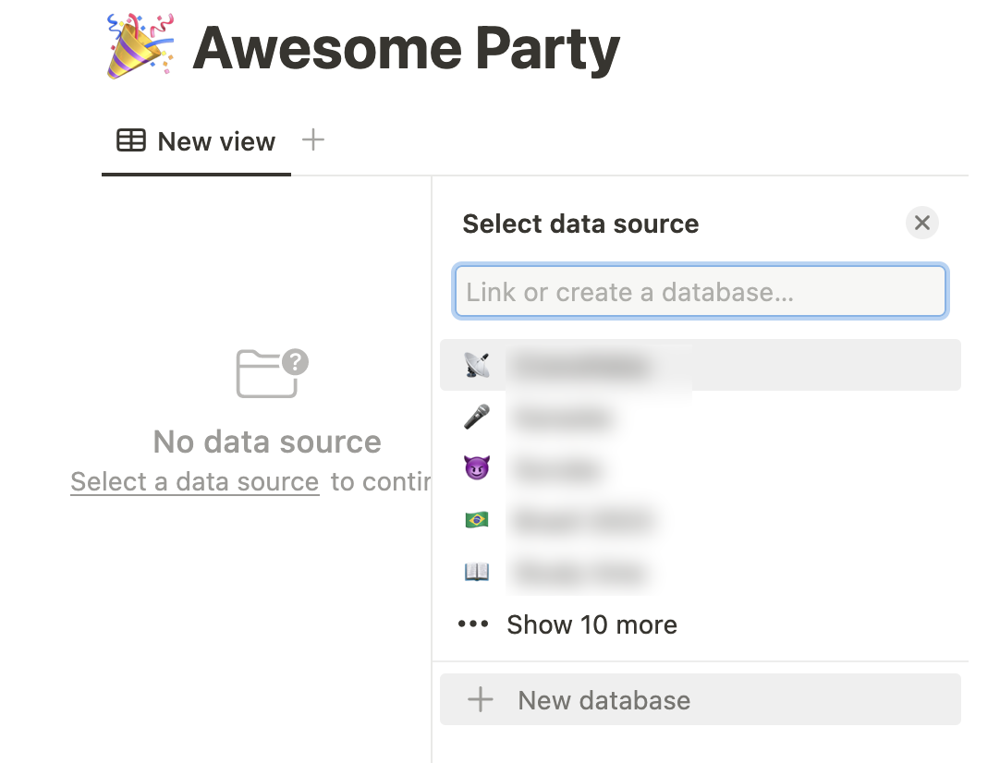
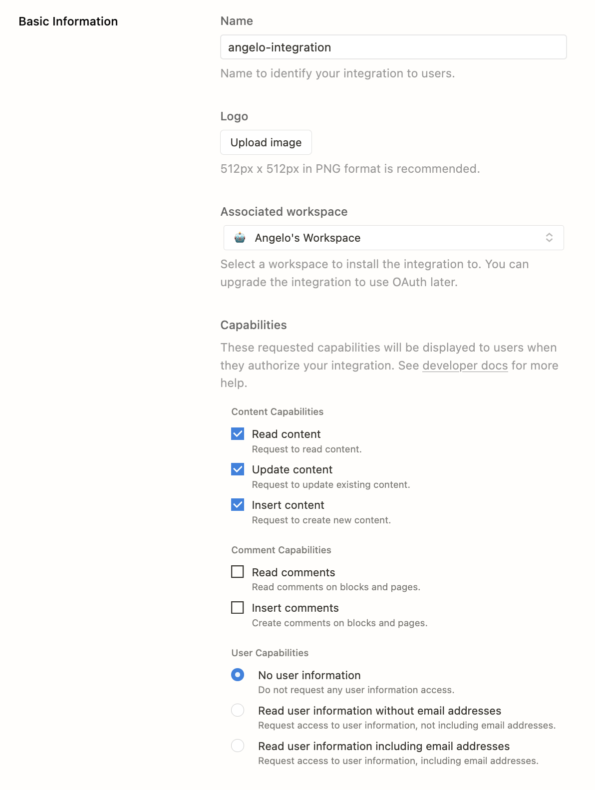

[Notion](https://www.notion.so/) is hard to describe. The tool manages notes, TODOs, tables, images, and a plethora of content that can help organise our lives — or make it completely chaotic if we fall into the "let me just create _another_ Notion dashboard" black-hole.

<!-- omit in toc -->
## Table of Contents

## Focus

This tutorial focuses on showing how to build something simple and straightforward in Notion: a database. We will use the Notion API and any form that can submit a POST request.

To make this even better, it will show you how to do it in NextJS and Remix, so you can pick your poison and just start building.

There will be a simple anti-bot solution as well, implemented with the least ammount of code possible.

### Skills needed

This tutorial can be read and understood by anyone with basic programming knowledge.

If you want to reproduce it, it's necessary to have a basic understanding of Javascript, HTML and CSS, as well as knowing something about the framework you select.

### Why?

Let's ponder: what is a database? Why should I create it? What's the meaning behind all of this? Is life worthy?

While you think about all of those, I'll give you a shortcut on the first two:

A **database** is, _very_ basically, a table. You might want to store information about who's going to your party or what items are lacking in your storage, I don't know. The important part is that with a database you can not only store this information, but list, filter, and display it as you want.

> If you are more tech-savvy, you know there's a lot more to databases than this, but for our usage this description will be enough.

We will create a database in this tutorial with a simple focus: getting the RSVP for a party. This is a simple example that I've tried in real life, so it's tested and proven.

## Notion

You must, first, create an account in [Notion](https://www.notion.so/) — something you can do with two clicks.

There are videos about "how to use Notion" around, but don't get too lost on those — I remember skipping lunch more than once after a few hours of these simple tutorials.

### Creating a database

On the left pane, you will see `Private` and a `+` symbol. If you click it, you will create a new `Page`.


You can see some options on what to do with that new page. Add a good name, an icon or header, and click that highlighted `Table` under (guess?) `Database`



This database is still empty, so Notion asks you to select a data source. Let's create a new one from scratch by clicking `new database`.

Now we have our nice `database` ready for destructi... I mean, customization!


### Customizing the columns

This database is comprised of columns and rows (it's just a table, remember)? The columns is what we want to know and each row is the gathered data.

In this case, for instance, we want to know the following information from our guests-to-be.

- First name
- Last name
- Do they have any food limitations?
- Will they bring a +1?
- How much money they will bring to gift me? (I'm a very straightforward person)

That decided, let's name our table rows with clear and easy-to-use-later names. I tend to avoid whitespaces, prefer separating words with hyphens and write everything in lowercase.


Notion offers a lot of options when creating new columns, but let's keep it simple here. I'll create the following columns:

- first-name (type: Text)
- last-name (type: Text)
- food-limitation (type: Select)
- plus-one (type: Checkbox)
- money-gift (type: Number)

With this we can cover the most common types of form fields.

The final form will look like this:


Now it's time to make it available to be used by our application.

### Accessing this database

In order to make this database accessible, you will need to create what Notion calls `Integration`. You can access the [My Integrations page](https://www.notion.so/my-integrations) to create one.

Click on the `New integration` button and fill the next form. Don't worry about logo for now.

The most important parts of this form are the `Content Capabilities` and `User Capabilities` parts.



#### Content Capabilities

Here you should check what your Integration can do in your Notion databases. For instance, if you want only a service to read an already created database, you would only check `Read content`.

#### User Capabilities

This field selects what information will Notion capture from the user that's sending the form. As we don't want it to capture anything else than what is in the form, we can select `No user information`. Not selecting this option can have legal issues if you don't add a cookie consent tool in your app.

### It's a secret

After clicking `Submit`, you will see a field with hidden data. That's you `Integration secret`. As the name says, do not show it to anyone. Copy it because we will use it shortly.

### Connecting the connection

After you created your Integration, access your database and, after clicking in the top three-dots menu, go to `Add connections` at the bottom and select your connection from the next menu. Click `confirm` and we're done.

### Getting the database key

For us to change this database in our code, we need a special secret key for it, along with the Integration key we got before.

This value is inside the Notion Database URL, between the `so/` and `?` Eg: the url `https://www.notion.so/Id?v=version` has four parts: `https://www.notion.so/`, an ID, `?`, and another ID starting with `v=` that represents the file version. What we want is the second part, the ID.

See the example below:

```txt
https://www.notion.so/a585d0ccdf3582cea6bdf1d8254813e6?v=44b0e900413547570f2791172fe2d1d5

url: https://www.notion.so/
id: a585d0ccdf3582cea6bdf1d8254813e6
version: v=44b0e900413547570f2791172fe2d1d5
```

Copy the ID for later use.

### What did we do?

After connecting this database with our Integration, whenever we make any API calls with this Integration secret key, Notion will know which databases the API call can modify. In this case, we added this database to that list.

If you try to modify another database without adding an Integration, Notion will return an error and nothing will be changed.

## Code

### NextJS

#### First, a disclaimer

I know there might be more performant ways to do a form like this, or even libraries like `Formik` to make it better, but I preferred to keep this pure React for the tutorial. There's already a lot going on.

Also, I will not add any validation or ways to avoid bots to the form, as it's not the point of this tutorial.

#### Setup

Let's setup a NextJS project as described in their website. So [click here](https://nextjs.org/docs/getting-started) and follow the steps. I will be creating an app with Typescript, but it's easy to follow it if you just know JS.

```sh
yarn create next-app --typescript
```


Let's `cd` into our folder, run `yarn dev`, and remove everything inside the `main` tag in the `src/pages/index.tsx`

#### HTML

Now, we're going to build our simple HTML form inside `main`. There's minor CSS to be done, so I'll use the already existing `Home.module.css` file that Next imports by default.

```jsx
<main>
  <form className={styles.form}>
    <div className={styles.wrapper}>
      <label htmlFor="first-name">First name</label>
      <input
        type="text"
        name="first-name"
        id="first-name"
        className={styles.mb}
      />
    </div>

    <div className={styles.wrapper}>
      <label htmlFor="last-name">Last name</label>
      <input
        type="text"
        name="last-name"
        id="last-name"
        className={styles.mb}
      />
    </div>

    <div className={styles.wrapper}>
      <label htmlFor="food-limitation">
        What kind of food can you eat?
      </label>
      <select
        name="food-limitation"
        id="food-limitation"
        className={styles.mb}
      >
        <option value="omnivorous">I eat anything</option>
        <option value="vegetarian">{"I'm vegetarian"}</option>
        <option value="vegan">{"I'm vegan"}</option>
      </select>
    </div>

    <div className={styles.inline}>
      <input type="checkbox" name="plus-one" id="plus-one" />
      <label htmlFor="plus-one">I will bring a +1</label>
    </div>

    <div className={styles.wrapper}>
      <label htmlFor="money-gift">How much money will you gift me?</label>
      <input
        type="number"
        name="money-gift"
        id="money-gift"
        min="0"
        className={styles.mb}
      />
    </div>

    <div className={styles.wrapper}>
      <input type="submit" value="Submit" />
    </div>
  </form>
</main>
```

Explaining the code above:

- We added a `form` that encompasses the fields;
- There's a wrapper `div` on each pair of label and input because of styling (next part)
- There's one input for each name part with according label;
- There's a select for the fixed food limitations;
- A checkbox is added and styled to the +1 question
- A number input is added for the most important question
- A submit button in the end closes the deal.

#### Styles

As you can see, I've added some `className`s there, so let's add this in our `Home.module.css` in the `src/styles` folder.

Let's just delete everything from this file and add the following styles:

```css
.form {
  padding: 1rem;
  display: flex;
  flex-direction: column;
  gap: 1rem;
}

.wrapper input,
.wrapper label {
  display: block
}

.inline input,
.inline label {
  display: inline
}

.inline label {
  margin-left: .5rem;
}
```

The code above:

- Adds some spacing between the fields with `flex` and `gap`;
- Makes the inputs look better by adding `block` or `inline`.

We won't add anything else to reduce complexity. Below is a screenshot of our stunning form:


#### Typescript (Frontend)

We will first set up what kind of format our form has. Let's set up a simple `type` after the imports:

```ts
type FormData = {
  "first-name": string;
  "last-name": string;
  "food-limitation": string;
  "plus-one": string;
  "money-gift": string;
};
```

> "But Angelo, isn't the `money-gift` a `number`? Or the `plus-one` a `boolean`?"

Yes, you have great eyes. The issue is that **HTML forms need data as strings**. We could even save the checkbox value as "boolean", but when passing it back to the controlled component, Typescript would warn us that the `checkbox` tag does not accept a `boolean` as a `value`.

With our types setup, let's add state to control our component. Add this after the `export default function Home() {` line:

```ts
const [values, setValues] = useState<FormData>({
  "first-name": "",
  "food-limitation": "omnivorous",
  "last-name": "",
  "plus-one": "false",
  "money-gift": "0",
});
  ```

We setup the `values` by adding some initial data and pointing it to the right data structure, `FormData`. We pre-set some values to avoid submittion errors.

In order to make each field controlled, we'd need to monitor their changes and update the state accordingly. We'd need to add the following code to each input:

```tsx
onChange={(e) => {
  setValues((values) => ({
    ...values,
    'first-name': e.target.value,
  }));
}}
```

That would be repeated in _every_ input, so I preferred to do a helper function to deal with this.

After the `useState` we wrote, add this:

```tsx
  const updateValue = (field: keyof FormData, value: string | boolean) => {
    setValues((values) => ({
      ...values,
      [field]: value.toString(),
    }));
  };
```

This function receives a `field` string — that can be only one of the `FormData` property names (that's what the `keyof` does) and an event (both Input and Select events) and a `value`, the string or boolean from the form.

When called, this function will get the current state and update it with the passed data.

Now, in each input (and select) we will add the helper function with the specific label and a `value` property as well, eg:

```tsx
<input
  type="text"
  name="first-name"
  id="first-name"
  className={styles.mb}
  onChange={(e) => updateValue("first-name", e.target.value)}
  value={values["first-name"]}
/>
```

Important: the checkbox will pass `e.target.checked` instead of `e.target.value`.

To finish, we will call a `handleSubmit` function when the user submits the form — to send this value to our NextJS API.

```ts
const handleSubmit = async (event: React.FormEvent<HTMLFormElement>) => {
  event.preventDefault();
  try {
    const response = await fetch("/api/notion", {
      body: JSON.stringify(values),
      method: "POST",
    });

    if (!response.ok) {
      return alert(`
      There was an error with your form submission:
      Status: ${response.status} - ${response.statusText}
      `);
    }

    return alert("Submission succesful");
  } catch (error) {
    return alert(`
    There was an error with your form submission:
    ${error}
    `);
  }
};
```

Line by line, we:

- Add an `async` to our function.
- Prevent the default `onSubmit` behaviour — refreshing the page.
- Add a try-catch clause because we will be dealing with async/await.
- call the native `fetch` with our local API url, passing as options:
  - the stringified body
  - the `POST` method
- `fetch` sometimes fail without throwing an error, so we add a check here to see if the `response` was not `ok`.
- If so, we `return` (to _short-circuit_ the function and stop it from continuing) and `alert` the user.
- If `response` was `ok`, then we `alert` the user everything went according to plan.
- The `catch` clause also returns an `alert`.

Finally, we add this function to our `form` tag:

```tsx
<form className={styles.form} onSubmit={handleSubmit}>
```

#### Typescript (Backend)

Create a `notion.ts` file inside `src/pages/api`. Copy the content from the default generated `hello.ts` and delete this file.

This file is our "Backend". In it we will receive the data from the form and pass ir forward to the Notion API.

First, let's clean this file.

Remove the `Data` type and add our `FormData`:

```ts
type FormData = {
  "first-name": string;
  "last-name": string;
  "food-limitation": string;
  "plus-one": string;
  "money-gift": string;
};
```

(You can also export the `FormData` from our other file and import it here)

Inside the `handler` function, change the `res` type to `NextApiResponse<void>` (we won't return anything on the response's body). Also, add `async` to `handler`: `export default async function handler`.

Remove the `json` method from `res.status(200).json({ name: "John Doe" });`, leaving just `res.status(200)`.

Now we have a clean file to work on.

We need to get the form data from the request and parse it.

In the first line of the function, add:

```ts
const data: FormData = JSON.parse(req.body);
```

Now, let's connect our Notion API. To do this we will need the API key and a Database key, and both need to be added to our Secrets.

Add an `.env` file on the project root and add the following there:

```txt
NOTION_API_KEY=
NOTION_PARTY_DB=
```

Remember the Integration Secret we saved from the last section? Paste it after the `NOTION_API_KEY` there.

Remember the database ID we saved from the last section? Paste it after the `NOTION_PARTY_DB` there.

> Why are we doing this?
>
> These are secret values and we don't want to share them with the user that visits our website, neither with someone that sees our source code. When deploying, these values will be hidden with Vercel or your choice of deployment service.

Back in our backend code, let's retrieve these values from our secrets and make sure they are present (throwing an error if not).

```ts
const data: FormData = JSON.parse(req.body);
const databaseId = process.env.NOTION_PARTY_DB;
const apiKey = process.env.NOTION_API_KEY;

if (!databaseId || !apiKey) throw new Error('The secret keys are missing');
```

Let's make sure whatever we want to do with this endpoint only runs when we use a `POST` by adding a short-circuit clause:

```ts
if (req.method !== "POST") return;
```

In order to call the Notion API we need to add their Javascript library, `@notionhq/client`. Let's run `yarn add @notionhq/client` then import their `Client` at the top of the file:

```ts
import { Client } from '@notionhq/client'
```

After our `POST` check, let's create a new Notion `Client`:

```ts
const notion = new Client({ auth: `${apiKey}` })
```

Sadly Notion has not perfect typings, so the best way to use Typescript with their library is to pass the object straight into the `create` method. So, see the entire part of the code below and I`ll explain it afterwards.

```ts
const response = await notion.pages.create({
  parent: {
    database_id: `${databaseId}`,
  },
  properties: {
    "first-name": {
      title: [
        {
          type: "text",
          text: {
            content: data["first-name"] ?? "",
          },
        },
      ],
    },
    "last-name": {
      rich_text: [
        {
          type: "text",
          text: {
            content: data["last-name"] ?? "",
          },
        },
      ],
    },
    "food-limitation": {
      select: {
        name: data["food-limitation"],
      },
    },
    "plus-one": {
      checkbox: data["plus-one"] === "true",
    },
    "money-gift": {
      number: parseInt(data["money-gift"]),
    },
  },
});
```

Let's go:

- We `await` a new notion `page` to be created — in Notion, that's the nomenclature for each row in a table, check the [docs](https://developers.notion.com/reference/page) for more info.
- As its options, we need to pass a `parent` object with our `database_id` inside.
- Inside the `properties` object is where the magic happens.
  - Each of the properties of our Notion table need to be here. The name of the object properties need to match our column names. In our case, `first-name` and so on.
  - The first property must have the `title` attribute. In summary, this is the "key" attribute that Notion will use as the title of your `Page` — if you have Backend knowledge: they have a key under the hood, so it's OK if this value gets repeated. You can read further on the Notion Docs.
  - The `last-name` property has a `rich-text` inside. It's because Notion does not have a simple `plain-text` field: all of them (except `title`!) can be formatted in their UI. As we didn't add any rich-text functionality — no bold, italic, whatever — then we just pass our `data` to the `content` prop.
  - `food-limitation` has a simple `select` with the `name` being the chosen option. Notion does not checks if this option is valid or not — if a new option is inserted, they will add it to the list of existing ones and move on (that's why we didn't need to setup them beforehand).
  - `plus-one` is a checkbox. All we need to do is to turn our `data` into the correct format, a `boolean`.
  - `money-gift` works exactly the same: a number field with a `number` value.`

I hope this description was understandable. Notion has _a lot_ of formats for each row, and their docs are thorough on it. I recommend giving it a good read.

To end our form submission, we return `200` (meaning that everything went well) if the `response` has an `id`. If not, we return `500` (meaning "ooops").

```ts
if (response.id) return res.status(200);
return res.status(500);
```

And... that's it for local development!

#### Testing

If you didn't do it before, stop the server and run it again with `yarn dev`. Open the `localhost` address and fill the form (be generous with the money, please). Click submit.


Now, open your database and see the value inserted there:


🎉 TADA! 🎉

#### Full code

You can find the project in [this repository in GitHub](https://github.com/angelod1as/notion-as-database-next), with the full code inside.

### Remix

