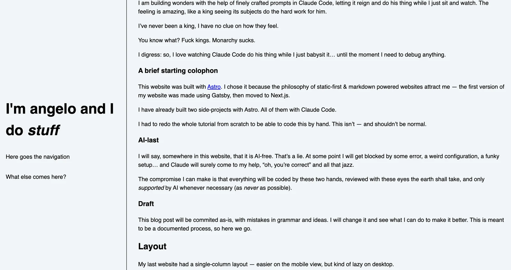
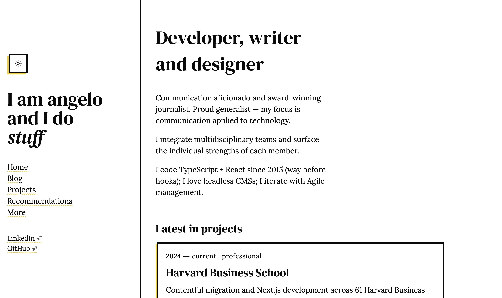

## First draft

This project starts with a simple purpose: AI is hindering my learning process.

I am building wonders with the help of finely crafted prompts in Claude Code, letting it reign and do his thing while I just sit and watch. The feeling is amazing, like a king seeing its subjects do the hard work for him.

Watching Claude Code do his thing while I just babysit brings me this amazing feeling... until the moment I need to debug anything. Then I realize I know shit.

### A brief starting colophon

This website was built with [Astro](https://astro.new). I chose it because the philosophy of static-first & markdown powered websites attract me — the first version of my website was made using Gatsby, then moved to Next.js.

I have already built two side-projects with Astro. All of them with Claude Code.

I had to redo the whole tutorial from scratch to be able to code this by hand. This isn't — and shouldn't be normal. I _coded_ those two projects, didn't I?

### AI-last

~I will say, somewhere in this website, that it is AI-free. That's a lie.~

I say, at the [more](/more) section, that this website is almost AI free. All of the creative work (I mean, this weirdly-flowing text is a great example of human-built narrative) is mine and mine only.

I can say with a clear mind that everything was coded by these two hands, reviewed with these eyes the earth shall take, and only _supported_ by AI whenever necessary (as _never_ as possible).

Does that mean that I didn't copy-paste anything from AI? No. But it means that I understood what I was doing, even the funky CSS. I commanded Claude: [do not code, just teach](https://github.com/angelod1as/portfolio/blob/main/CLAUDE.md).

## References

I am mainly building this as a goal to be featured on [sidebar.io](sidebar.io) newsletter.

Honestly, that's it. I want to be read so I want to make text my focus. In the past, this website's focus was to showcase my skills and make myself sellable — but I can see that's not very useful if I'm going to fail on some interview with a stupid coding algorithm no one will ever use in production.

I want to try my best to showcase my mind, not my work. I want to be hired because of who I am, not simply because of what I can do.

This movement of rebuilding my personal website came mainly from [Andy Bell](https://bell.bz/). A lot of other websites served as inspiration, such as:

- [Mitchell](https://mitchellh.com/writing)'s website is mainly what I want to do, with nice TOCs and simple design.
- [Terry](https://www.terrygodier.com/) made something beautiful (although too fancy for me)
- [samhenri](https://samhenri.gold/blog/)'s blog is straight to the point, no fuss.
- [matt stromawn](https://mattstromawn.com/)'s website is sleek, clean, and has an interesting font-switcher at the top.

I surely have a larger inspiration list, but these come to mind now.

### PS: Versioning

~I'll build a versioning system ASAP for these posts. I mean: I will add a version of a post linked to a commit. When I create a new version (and commit), I'll link it. If you want to see the older version, you can just click the "version" and see it in github (this project is open source, after all).~

I ended up adding a "see file history" link that opens this file's history in git. Versioning in this way is complex. I need to move to MDX and create some kind of "Old" component to display deprecated thoughts.

## Design Choices

I used to work as a designer for Latin America's biggest newspaper. This made me see design under a very specific lens: newspapers are made the way they are for a reason. Serifs everywhere, columns, bold titles in various formats, glorious black-and-white, infographics. Everything is fit in the (back then) large-format paper and we, designers, make sure it looks _harmonious_.

Websites go very differently.

Space is nearly infinite; the reading order is almost linear — especially on mobile —; it's not paper, alas not static; colors are free; images (and "weight") are expensive.

At the same time, we're always searching for the same harmony of the newspaper — making sure our readers have a good experience, that they find what they're looking for and that their focus is not meddled with.

Well, websites go _almost_ very differently.

### Layout

My last website had a single-column layout — easier on the mobile view, but kind of lazy on desktop.

To keep stuff simple _but elegant_ I chose the desktop two-column view — a fixed left column with menu and the rest for the content. I wanted to add a third column, to the right, to house sidenotes and TOCs, but I didn't design it in time for production, so I left it out ¯\_(ツ)\_/¯. The idea is to allow text to flow without losing focus on the publication: "this is my website, please click around, there's more to see".

The idea for the new one is ~stolen~ inspired by some websites I mentioned above. This is ~the current state~ one state of it:

The current state is **very barebones** but it is what I can deal with at this moment.

### Fonts

For this website I studied a few font pairings. The old version had _Montserrat_ for text and _Montserrat Alternates_ for headings (see image above).

I liked that combination, with those colors, with that size. But now, thinking about a simpler, text-focused design, I went more _newspaper-y_ than ever.

Fonts I tested:

<!-- cSpell:disable -->

- DM Serif Display
- Playfair Display
- Inter
- Fraunces
- Manrope
- Lora
- Bodoni Moda
- Work Sans

Fraunces is a funny name; Manrope is beautiful; Bodoni Moda is less sexy than the original; I'm a bit tired of Playfair Display.

<!-- cSpell:enable -->

The final pairing was **DM Serif Display** and **Lora**.

Yeah yeah, I know about "sans for title, serif for text" we usually hear — but that's for print. Most font pairings I found for web have _serif_ for titles and _sans_ for text — which makes the designer in me scream in agony. So, in (a very petty) defiance of the current design standards, I went with _two_ serif fonts. Complaints are not welcome at this time.

## Conclusion

This very weird post was just an introduction to why I redesigned my website for the third time. It doesn't say a lot, it is a bunch of different topics together, but it is enough for inauguration.

I say: this is ready for prod.
