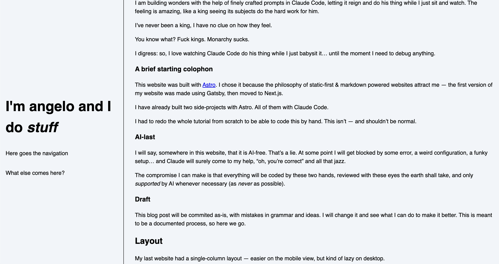

## First draft

This project starts with a simple purpose: AI is hindering my learning process.

I am building wonders with the help of finely crafted prompts in Claude Code, letting it reign and do his thing while I just sit and watch. The feeling is amazing, like a king seeing its subjects do the hard work for him.

I've never been a king, I have no clue on how they feel.

You know what? Fuck kings. Monarchy sucks.

I digress: so, I love watching Claude Code do his thing while I just babysit it... until the moment I need to debug anything.

### A brief starting colophon

This website was built with [Astro](https://astro.new). I chose it because the philosophy of static-first & markdown powered websites attract me — the first version of my website was made using Gatsby, then moved to Next.js.

I have already built two side-projects with Astro. All of them with Claude Code.

I had to redo the whole tutorial from scratch to be able to code this by hand. This isn't — and shouldn't be normal.

### AI-last

I will say, somewhere in this website, that it is AI-free. That's a lie. At some point I will get blocked by some error, a weird configuration, a funky setup... and Claude will surely come to my help, "oh, you're correct" and all that jazz.

The compromise I can make is that everything will be coded by these two hands, reviewed with these eyes the earth shall take, and only *supported* by AI whenever necessary (as *never* as possible).

### Draft

This blog post will be committed as-is, with mistakes in grammar and ideas. I will change it and see what I can do to make it better. This is meant to be a documented process, so here we go.

## References

I am mainly building this as a goal to be featured on [sidebar.io](sidebar.io) newsletter.

Honestly, that's it. I want to be read so I want to make text my focus. In the past, this website's focus was to showcase my skills and make myself sellable — but I can see that's not very useful if I'm going to fail on some interview with a stupid coding algorithm no one will ever use in production.

I want to try my best to showcase my mind, not my work. I want to be hired because of who I am, not simply because of what I can do.

This is a inspiration list:

- [Mitchell](https://mitchellh.com/writing)'s website is mainly what I want to do, with nice TOCs and simple design.
- [Terry](https://www.terrygodier.com/) made something beautiful (although too fancy for me)
- [Dir14](https://www.dir14.com/) has some great design, hovering for images, nice transitions. I want it smaller, though.
- [samhenri](https://samhenri.gold/blog/)'s blog is straight to the point, no fuss.
- [lesswrong](https://www.lesswrong.com/posts/KRLGxCaqdgrotyB8z/there-are-only-four-skills-design-technical-management-and): I love lesswrong's footnote/sidenote design.
- [matt stromawn](https://mattstromawn.com/)'s website is sleek, clean, and has an interesting font-switcher at the top.
- [Raj](https://rajnandan.com/)'s site is also straight to the point, with similar sections as mine.
- [chrbutler](https://www.chrbutler.com/reactionary-red-lining-of-ai): I mean, nice take on "left-aligned".
- [Karl Koch](https://karlkoch.me/): not my color choice, definitely my animation choices.
- [Hardik](https://hvpandya.com/power-prompts) added a very fun sidebar TOC.
- [Andy Bell](https://bell.bz/)'s website and his process of building it (told via [Piccallili](https://piccalil.li/)) is amazing.

I surely have a larger inspiration list, but these come to mind now.

### PS: Versioning

~I'll build a versioning system ASAP for these posts. I mean: I will add a version of a post linked to a commit. When I create a new version (and commit), I'll link it. If you want to see the older version, you can just click the "version" and see it in github (this project is open source, after all).~

I ended up adding a "see file history" link that opens this file's history in git. Versioning in this way is complex. I need to move to MDX and create some kind of "Old" component to display deprecated thoughts.

## Layout

My last website had a single-column layout — easier on the mobile view, but kind of lazy on desktop.

The idea for the new one is ~stolen~ inspired by some websites I mentioned above. This is the current state of it:

