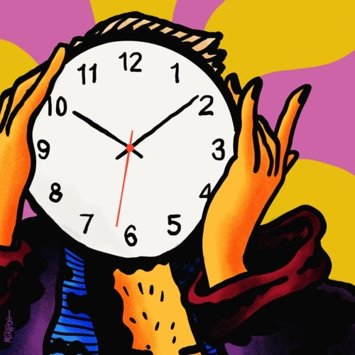

<Small className="italic">
  This page is in Brazilian Portuguese only. Sorry, English speakers!
</Small>

Publico um podcast (quase) **diário** no [Anchor](https://anchor.fm/cronofobia), grátis e disponível em **várias** plataformas (inclusive Spotify).

## **Pergunte** o que quiser

Abaixo você pode fazer _qualquer_ pergunta e ela provavelmente será lida no Podcast.

Não esqueça de entrar no [canal do Telegram](https://t.me/+rhMJHVx2uhw2MDcx) para comentar os últimos episódios com os ouvintes.

Sem limites ou tabus — **pergunte qualquer coisa**

<AskForm />

### Últimas perguntas respondidas

<OldQuestions />

## Artes da capa!

### Da terceira temporada até hoje

A arte atual foi feita pelo artista Silva João, com quem eu publiquei a HQ [Combo Breaker](/combo-breaker) (leia de graça)

### Segunda temporada

A capa foi feita pela tatuadora e artista [Janaína Sirena](https://www.instagram.com/janainasirena)

### Primeira temporada

Não tinha uma capa até que o ilustrador [RAVAEL (aka msrapoo)](https://www.instagram.com/msrapoo/) me deu uma!

