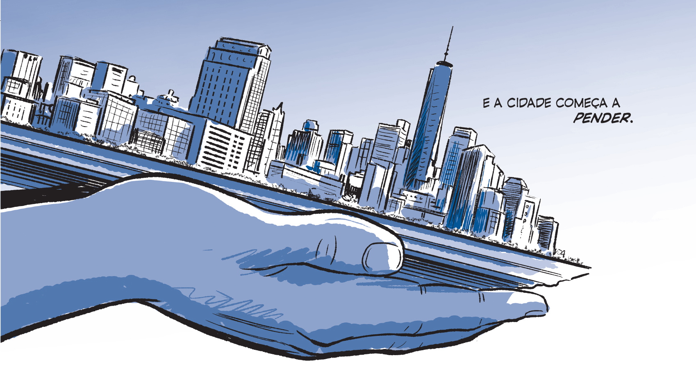

I interviewed and wrote a piece about Scott McCloud's first work after his comics studies. It can be read below, in Brazilian Portuguese.

I recorded our interview and made the answer to some questions available to the reader — something not usual for Folha de S.Paulo stories.

### Questions & answers

Why a sculptor and not a comic artist?
<Audio src="../content/projects/2015/scott-mccloud/scott-1.mp3" />

How does sculpture behave in the frames of a comic?
<Audio src="../content/projects/2015/scott-mccloud/scott-2.mp3" />

Do you consider yourself an academic?
<Audio src="../content/projects/2015/scott-mccloud/scott-3.mp3" />

Why the choice of just three colors in "the sculptor"?
<Audio src="../content/projects/2015/scott-mccloud/scott-4.mp3" />

---

Below, the original piece.

### Teórico dos quadrinhos, Scott McCloud lança livro em SP

"Minha maior esperança era que as pessoas quase esquecessem que eu era um teórico e que vissem a HQ como uma história pura", diz o quadrinista americano Scott McCloud, 55, autor de três importantes livros sobre a teoria desse gênero.

Ele vem ao Brasil no evento Comic Con Experience, em dezembro, para o lançamento de sua primeira ficção longa em 25 anos, a graphic novel "O Escultor" (do selo Jupati Books, editora Marsupial).

O livro, um calhamaço de 500 páginas, narra a história de um jovem escultor que faz um acordo com a morte. Em troca do poder de esculpir qualquer coisa com as mãos, David Smith concorda em viver só mais 200 dias.

Mas isso não é o bastante para afastá-lo da frustração de ter seus trabalhos rejeitados. Mesmo com seus novos poderes, Smith não é um bom escultor e ninguém compra o que produz.

É a atriz Meg quem o salva de sua autodestruição, o que resulta em uma paixão cheia de segredos. "Há um pouco de mim no protagonista e muito de minha mulher em Meg", admite McCloud.

O livro, que aborda vários temas simultaneamente, como amor, comércio, morte e arte, será adaptado pela Sony para o cinema.

### Teórico X artista

Não há como separar o teórico do artista: "O Escultor" é o exemplo de que McCloud faz o que fala. O livro reflete ensinamentos que já estavam em trabalhos anteriores do autor, como a utilização de um só quadro na página inteira ou desenhos da cidade para situar o local da história.

"Se precisarem escolher um termo, prefiro quadrinista", diz McCloud, mais conhecido por seu trabalho como teórico do que como escritor de ficção. "O que faço são quadrinhos, só um pouco é teoria. Essa é a parte mais importante do que sou. Todos os dias sento e desenho coisas."

Seus três livros sobre quadrinhos (em forma de quadrinhos), não são obras acadêmicas, mas se tornaram referência sobre o tema, e são citadas em artigos e pesquisas.

"Desvendando os Quadrinhos" (2004), "Reinventando os Quadrinhos" (2005) e "Desenhando Quadrinhos" (2007) –editados no Brasil pela M. Books– são utilizados em cursos e aulas sobre o tema.

"Minha escrita sobre quadrinhos veio de experiência própria. Eu era só um artista jovem com um monte de ideias loucas e resolvi colocá-las no papel", afirma.

O processo de desenvolvimento de "O Escultor" durou cinco anos. McCloud diz que nunca havia pensado por que escolheu um escultor como protagonista até ser questionado sobre a decisão em entrevistas. "Quando você cria algo, considera várias decisões, mas às vezes se esquece da primeira de todas."

Além do preto e branco, só uma cor –um tom de azul próximo ao cobalto (na escala usada pela indústria gráfica, o Pantone 653)– permeia a obra, criada de forma digital.

"Meu senso de cor não é tão bom. Precisaria colaborar com alguém para colorizar, então preferi escolher uma cor só", justifica.

### No cinema

"O Escultor" ganhará uma adaptação ao cinema. Os direitos da obra foram compradas pela Sony.

McCloud diz que gosta de assistir a essas adaptações, mas faz uma ressalva: se incomoda quando artistas não recebem créditos pelo trabalho. Como exemplo, cita o desenhista Jack Kirby (1917-1994), que trabalhou na Marvel com Stan Lee e foi cocriador de personagens como o Capitão América e o Homem-Formiga. Em alguns filmes, seu nome não ganha tanto destaque quanto o de Lee.

Em geral, porém, a união contribui para a aceitação das HQs. "Hoje há lugar para conversar sobre quadrinhos na mesa de jantar", diz. Mas ainda há preconceito. "Muitos pensam que HQs são pessoas em roupas apertadas batendo umas nas outras. É claro que são muito mais que isso."

O futuro é otimista, diz ele, e a evolução está na variedade, de criadores e formatos. "O crescimento está na produção de HQs mais maduras para adultos, mais interessantes para crianças e mais inovadores na internet."

Em "Reinventando os Quadrinhos" (2000), o autor aborda 12 tipos de evolução –que os quadrinhos possam ser reconhecidos como arte, por exemplo. "Hoje vejo progresso em quase todos os tipos", diz. "A abrangência das HQs está tão grande que é difícil ver onde começa e termina."

_Originally published at [Folha de S.Paulo](https://www1.folha.uol.com.br/ilustrada/2015/09/1686541-teorico-dos-quadrinhos-scott-mccloud-lanca-livro-em-sp.shtml)_