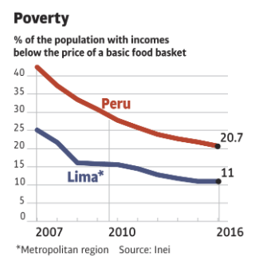
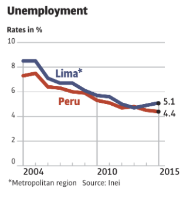
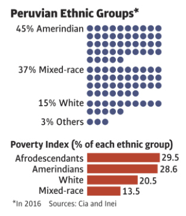

With heavy focus on photography and video documentaries, 'A World of Walls' is an award-winning feature from Folha de S.Paulo. From it's summary:

> A more and more interconnected world is raising walls and fences to keep out those it considers undesirable. The number of physical barriers that existed in 2001 was 17: the figure has presently jumped up to 70.
>
> Some of them reinforce borders. Others divide the same population. Some seek to stop the refugee flow. Others hide poverty. Or fear. Or war. Or inequality. Or climate change.
>
> Folha went to four different continents to uncover what - and who - lies behind them.

'A World of Walls' is available in [Portuguese](https://arte.folha.uol.com.br/mundo/2017/um-mundo-de-muros/), [English](https://arte.folha.uol.com.br/mundo/2017/a-world-of-walls/) and [Spanish](https://arte.folha.uol.com.br/mundo/2017/un-mundo-de-muros/)

## Awards

- [Grande Prêmio Petrobras de Jornalismo 2018](https://www1.folha.uol.com.br/poder/2018/11/folha-vence-grande-premio-petrobras-de-jornalismo-2018.shtml)
- [King of Spain prize - digital journalism](https://www.agenciaefe.es/premios-rey-espana/)
  > Otorgado por unanimidad a Patrícia Toledo de Campos Mello, de Brasil, por el trabajo «Un mundo de muros», publicado en la Folha de S.Paulo el 26 de junio de 2017. El jurado valora la buena factura del trabajo con un diseño muy atractivo y todos los contenidos -foto, vídeo 360º e infografías-, de una gran calidad y perfectamente integrados. El trabajo multimedia versa sobre la construcción de muros en distintos lugares del mundo y sus consecuencias en el día a día para emigrantes, refugiados, personas con menor poder adquisitivo y zonas afectadas por otros motivos.
- [International Humanitary Coverage prize - Red Cross](https://www.icrc.org/pt/document/brasil-cerimonia-premio-cicv-de-cobertura-humanitaria-internacional)
- [Grande Prêmio Folha 2017](https://www1.folha.uol.com.br/poder/2018/02/folha-premia-especial-um-mundo-de-muros.shtml)
- [ÑH2017 - Society of News Design](https://www1.folha.uol.com.br/poder/2017/11/1934429-folha-ganha-quatro-medalhas-em-premiacao-de-associacao-de-design.shtml)

### Development

The main issues with this project was the heavy reliance on photography and video formats. We had to work around Folha's technology demands and develop a mosaic-esque scheme for the pictures — beautifully handpicked — and ways to display 360º and regular videos with different looks and impacts on performance.

Working together with editors, journalists and photographers, the digital team had a big part in mixing text, images and videos together, making a probable masterpiece in journalism.

\* Cover photo by Lalo de Almeida/Folhapress