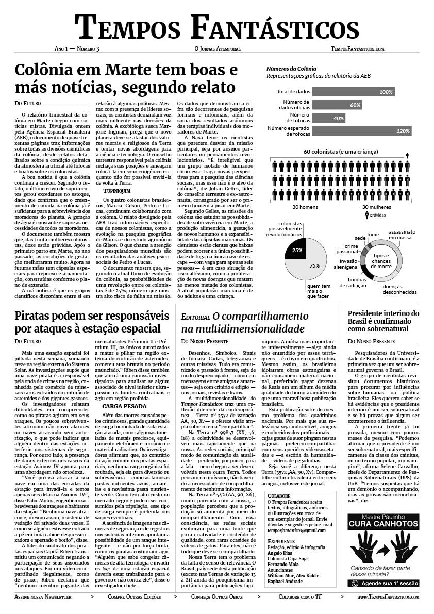
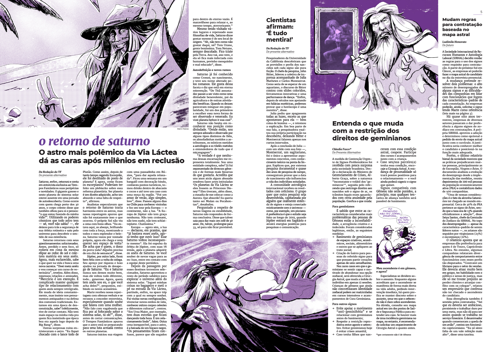

🚨 Important! 🚨

I'm currently editing a book that will comprise **everything ever published** in Tempos Fantásticos. It's over 350 pages long. To know more, [sign up for the newsletter](https://temposfantasticos.substack.com/) (in Brazilian Portuguese)

## About the project

> _[Tempos Fantásticos](https://www.temposfantasticos.com/)_ is a satirical sci-fi and fantasy newspaper, with features about the alternative futures, presents and pasts.
>
> It's possible to find news, ads, comic strips, illustrations, opinion pieces — like the one about tourism in imaginary places and obituaries of people from all time and space — and interviews with universal personalities — like the lovecraftian Cthulhu and the demonic Devil.
>
> A legitimate newspaper, like many others, in which all is fiction and any resemblance to reality may or may not be a coincidence.
>
> (from the former official website)

Tempos Fantásticos (TF) is my **main project** since 2016.

It's an excuse to mix my journalism education, fiction writing, layout design, web development, and more skills into this **singular piece of art**.

It has been a _wild ride_; our format has changed from a **double-sided black-and-white A3 sheet of paper** to a **full-fledged 4-color 8-pages newspaper**. The first edition had material only from myself, the last ones had collaborations from proeminent brazilian writers.

From this (3rd edition):

To this (25th edition):

## Media and academy

Tempos Fantásticos has been the theme of an **academic article**: [Other possible times: disputes about values and conventions of journalism in Tempos Fantásticos.](http://periodicos.uff.br/contracampo/article/view/19457/pdf)

From it's abstract:

> This article analyzes how Tempos Fantásticos, a satirical newspaper published in Brazil since 2016, summons matrices of the fantastic to dispute values and conventions of the journalistic canon. Taking as conceptual and methodological frameworks the works of Raymond Williams and Jesús Martín-Barbero and their efforts to consider historicities in any analysis of culture, we show how the experimentation around "fictional journalism" of Tempos Fantásticos means to dispute the ethical imperative that legitimizes journalism as a social institution and one of its central values, currency. This movement evidences political and cultural disputes in the treatment of values and conventions of journalism, time and reality.

The newspaper also was part of **Marcela Souza's research** on brazilian periodic publications, available [here, in portuguese](https://souzama21.wixsite.com/periodicos).
