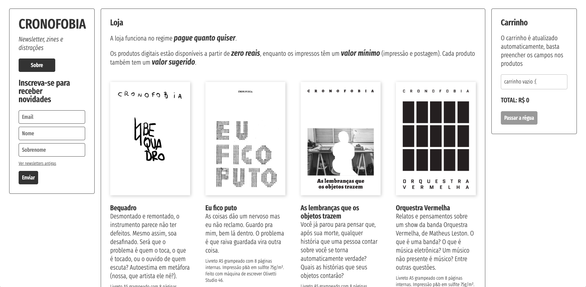

I decided to make zines in any way I wanted, without following set rules or schedule. In order to do that, I set up my **first e-commerce** website, and started selling these publications in a **pay-what-you-want** way (influenced by [Panel Syndicate](http://panelsyndicate.com/))

## Design

I wanted the website to be as simple as possible, without navigation changes, making everything showing up at the same moment. The design was influenced by my need to learn React and the way its states communicate. It would be so much easier to code it with today React standards and toolkit.

As the zines would be printed in black and white, with a LOT of whitespace, I chose this contrasted look as my design choice.

Instead of hard to look at screenshots, [see it live here](http://www.cronofobia.com/).

## Writing

All of the zines were written in a day or two — some took a day to drawn and another to write. Some of them were edited in InDesign, others were just xeroxed and passed forward. There are mixed themes and ideas, and I'd really love if you could go there and download them. Payment is disabled at the moment.

[What do you think?](http://www.cronofobia.com/)

## Coding

This was one of my first React websites outside of my day-job at Folha de S.Paulo. The code might be messy, but it was a great learning experience. [See it here, feel free to fork it](https://github.com/angelod1as/cronofobia).

I thank Pilker, Rubens Fernandes, Thiago Almeida and Lucas Golino for the boilerplate, feedback and (mainly) enormous patience. I specially thank Lucas Golino for helping me write the back-end, a very messy connection with Mercado Livre's API — the worst API documentation I've ever seen in my life.