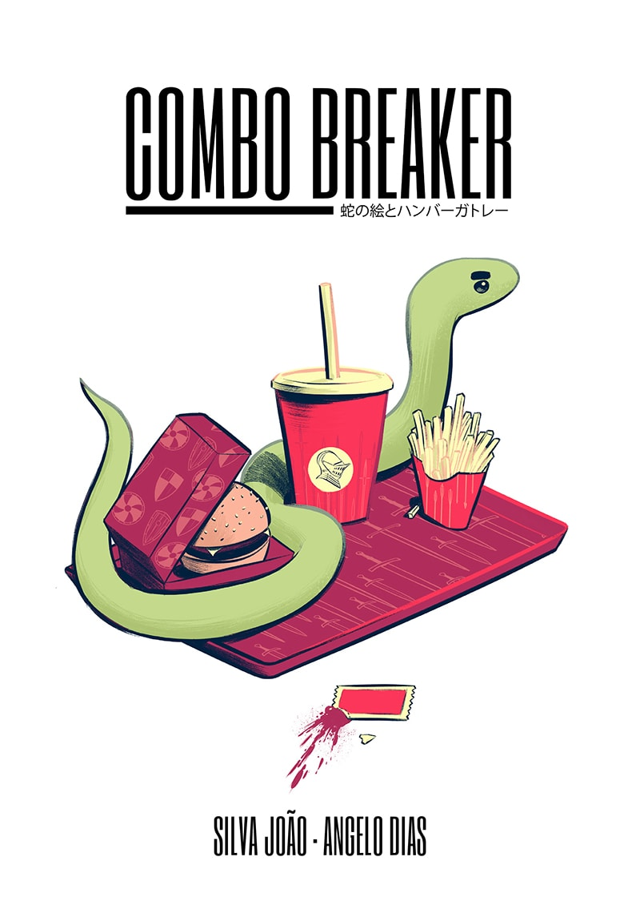
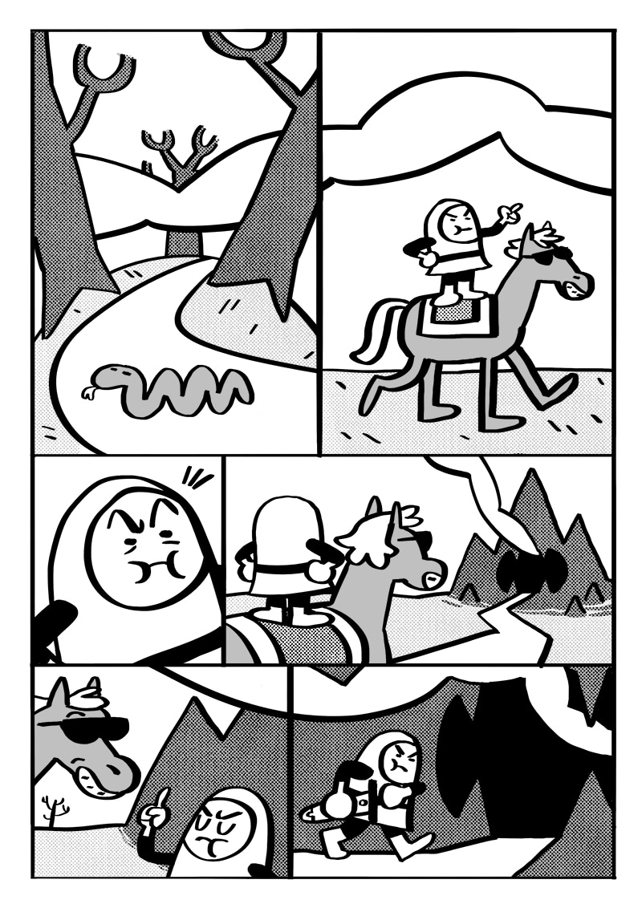
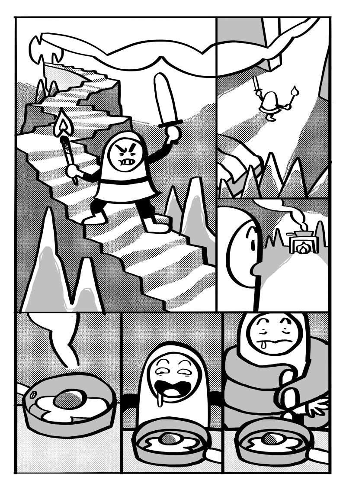

I wrote a comic script and [Silva João](https://www.facebook.com/silvazuao/), Brazilian illustrator and comics artist, asked to draw it.

Why? That's the one million dollar question.

He turned my five pages script into a full blown 50 page graphic novel.

[You can read the entire story for free clicking here.](https://tapas.io/episode/1291897)

