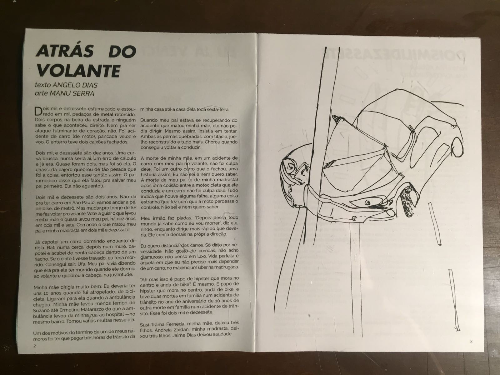
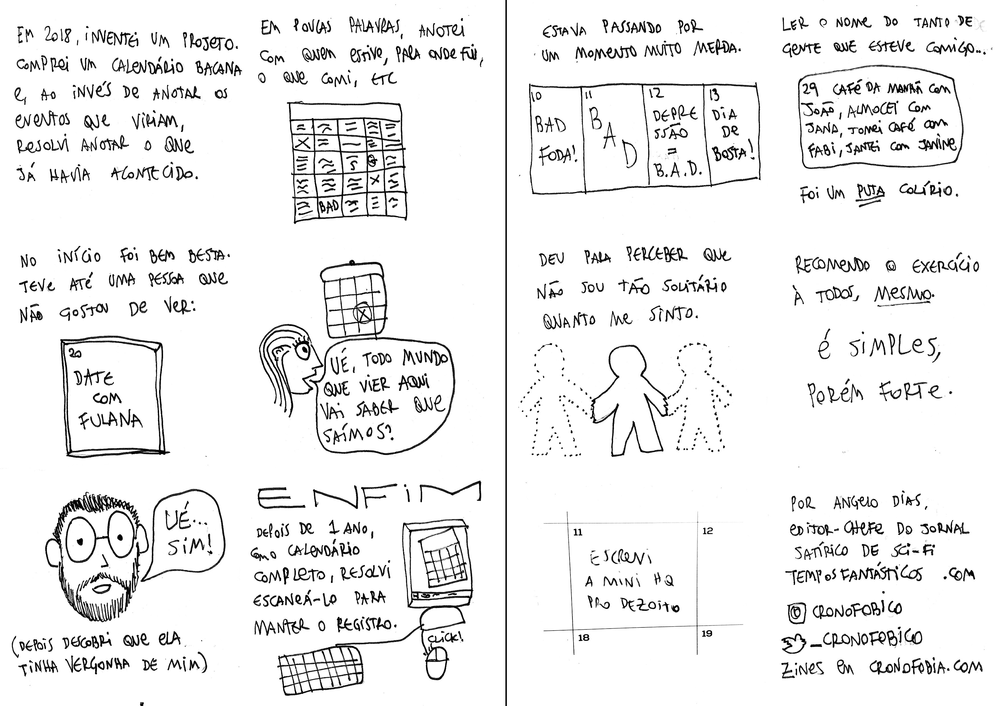

Videographer, musician, and editor Stefano Maccarini publishes an yearly zine with multiple artists about the year that just passed. I participated in many of his productions.

## Behind the Wheel (2017)

My participation in Dezessete (in English, "Seventeen") is a narrative about how my mother died in a car accident in 2007 and, 10 years later, my father and stepmother ended up having the same fate. 

[Read it here](https://medium.com/dezessete/atr%C3%A1s-do-volante-bfb93c41b891).

## Nice Calendar (2018)

In Dezoito (Eighteen), I drew two comics pages about one of my favourite projects: an inverted calendar.

Instead of writing about the appointments I'll have, I write about what have happened, who I met, and what I did.

[Read it here](https://medium.com/dezoito/calend%C3%A1rio-bacana-ff6b68c85984)... or below (open the image in a new tab to see a bigger size).

## Mutual Hatred (2019)

My Dezenove (Nineteen) participation resulted in a very emotion and angst-ridden article about hate and how I deal with people that fuck up my friends.

[Read it here](https://medium.com/dezenove/%C3%B3dio-rec%C3%ADproco-6344c78d0373).

## Twenty (2020)

This case was weird.

I wrote a comics script about the pandemics that would be illustrated by a friend of mine but... she never delivered the art.

So I published the raw script `¯\_(ツ)_/¯`.

[Read it here](https://medium.com/vinte/vinte-5b8648db810e)