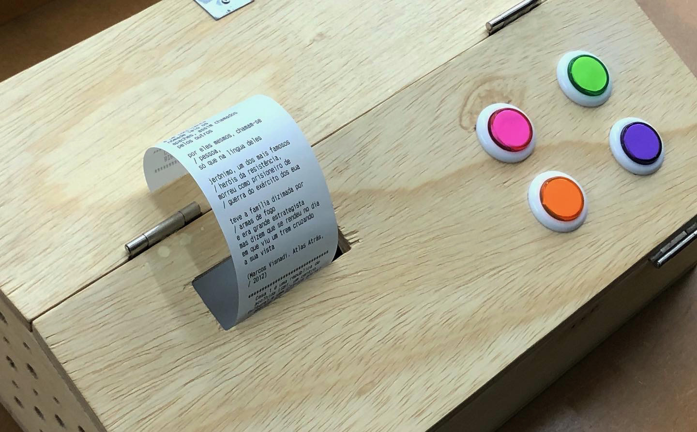

_Recibo_ means _receipt_ in Brazilian Portuguese. [Read more about it (in Portuguese) here.](https://www.casaum.org/biblioteca-comunitaria-caio-f-abreu-lanca-projeto-recibo/)

## Concept

I started fiddling with a thermal printer to know how to interface with it, in a process of bringing my programming skills out of the web development space.

When I shared this process in my Instagram, one of [Casa 1](https://www.casaum.org/)'s collaborators got in touch. After some conversation on how to unite the thermal printer technology with literature, we got to the idea of a machine that would print text material with the press of a button.

As I always wanted to collaborate with Casa 1 in a tangible way, I proposed to build this machine and donate it to them — leaving the code open source. As a way of making the process easier, they offered to buy the hardware — a thermal printer, a raspberry pi, an arcade board to work with the buttons, and the wooden case — and I accepted.

The final product is comprised with four coloured buttons. Pressing one of them triggers the machine to print:

- A poem
- A short story
- A kid's activity (like coloring images)
- A comic strip



## Development

I started fiddling with a thermal printer with NodeJS, as Javascript is my main language. As I didn't find a reliable way to interface with the printer, I moved to a language that had more reliable and battle-tested libraries.

I had never coded in Python before, so I had to understand its basics and not-so-basics as my work grew. I had a lot of fun understanding the difference in syntax and even had the pleasure of having my code reviewed by [Cuducos](https://github.com/cuducos), a great Python developer.

Other helpful people were
[Belono](https://github.com/belono), from the [Python ESC/POS](https://github.com/python-escpos/python-escpos/) community, and the always ready [Jonas Marques](https://twitter.com/jonassmarques).

The code is open source and [can be seen here](https://github.com/angelod1as/recibo-poem-printer).

## Build your own

- Raspberry Pi 3 Model B + 16gb card
- POS-5890C printer
- Sandisk 16gb flash drive
- Zero Delay Arcade card + nylon arcade buttons

The Zero Delay card, connected to the buttons, feeds controller information through USB to the Raspberry Pi. It, running my program, reads the according file and sends its content to the printer.

### Flash drive

You must have, inside the flash drive, the following file structure:

- a `DO_NOT_DELETE.txt` empty file
- a `poem-printer` folder with this script
- a `files` folder with your text/images folders
  - The working version has four folders: comics, poems, short-stories and kids.
  - In order to add more folders, you need to edit the code in `__init__.py`.

### Zero Delay card

The Zero Delay card is self-configurable. The only necessary part is knowing which button triggers each event.

Sadly, this can only be done by trial-and-error (connect a button, press it, see if anything happens, note it down) or by changing the code in `__init__.py` that receives the button inputs (around the end of the file).

### Raspberry Pi

It's easier to flash an existing Poem Printer card, but if not found, you need to do the following manually to a fresh Raspbian install.

Copy the `flash_drive.sh` to your Raspbian home folder, then edit `/etc/rc.local` file at Raspbian like this:

```sh
# Mounts the flash drive and copies the files to your Pi
sudo sh /home/flash_drive.sh
# Runs the script
sudo python3 /home/pi/poem-printer/poem-printer/src/__init__.py &

exit 0
```

- The `/dev/sda1` can change, depending on your system.

The only downside is that it takes a few seconds to boot completely.

(If you know a way to run the script ONLY after the USB drives were mounted succesfully, please let me know. All my attempts failed)

- To watch rc.local after boot: `grep rc.local /var/log/syslog`
- To test without rebooting, run `sudo /etc/rc.local` on your Pi. If it complains about `resource busy`, restart your printer.

There is a `kill button` implemented in this version. It's a button that, when clicked, quits the process and allows you to restart it.
