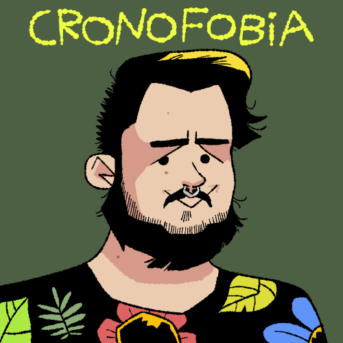
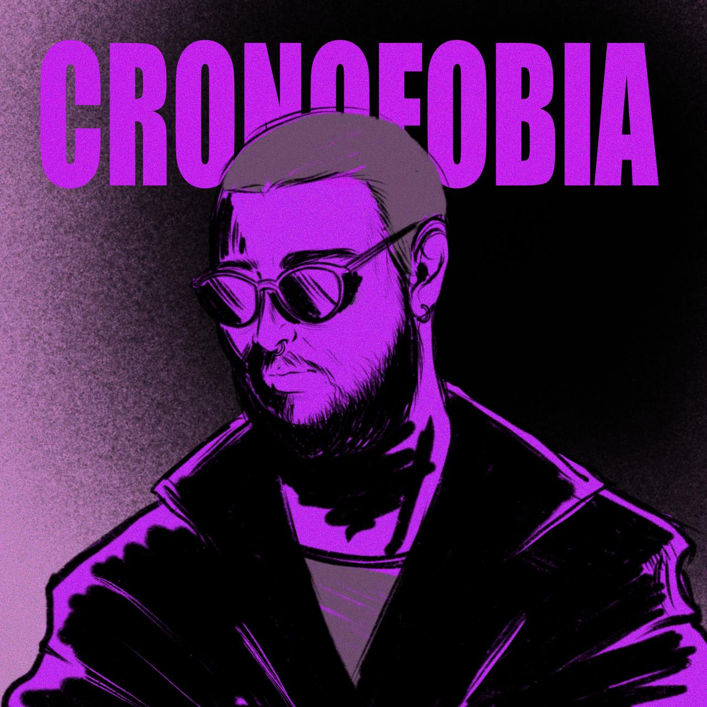

## Answering _any_ question from _anyone_

The format was simple: any person could ask any question anonymously or not through a form in a website. I would get these questions, list them, and answer one by one in a mini podcast — 5 to 10 minutes per episode, tops.

That fueled 525 episodes with themes ranging from polyamory, through communism, to food options in Germany.

I recorded with family, friends, and professional contacts, but most of it is me and a microphone — and [an automated editing workflow](/blog/daily-podcast).

The podcast is recorded in Brazilian Portuguese and still can be listened to at [Spotify Podcasts](https://anchor.fm/cronofobia) — it has an RSS feed also, for other podcast players.

## Cover arts

### From the third season to today

The current art was created by the artist Silva João, with whom I published the comic [Combo Breaker](/combo-breaker) (read for free)

### Second season

The cover was made by the tattoo artist [Janaína Sirena](https://www.instagram.com/janainasirena)

### First season

There wasn't a cover until the illustrator [RAVAEL (aka msrapoo)](https://www.instagram.com/msrapoo/) gave me one!

## Colophon

- Hardware
  - A [Razer Seiren Mini Microphone](https://www.razer.com/streaming-microphones/razer-seiren-mini/)
  - My PC and/or laptop
- Software
  - [Audacity](https://www.audacityteam.org/)
- Publishing
  - [Spotify Podcasts](https://podcasters.spotify.com/), former Anchor
- For the questions
  - Formspring (offline)
  - [Curiouscat](https://curiouscat.live/)
  - A [self-build Notion-powered form in this website](/blog/notion-form).

  ## Why "coding"?

  This project is also under the "coding" category in my portfolio for a simple reason: building the [script used in Audacity](/blog/daily-podcast#script) to basically automate my editing process was a coding effort.

  I even researched how to do it in a CLI, but the results were not that good, so I stayed with Audacity's macro functions.