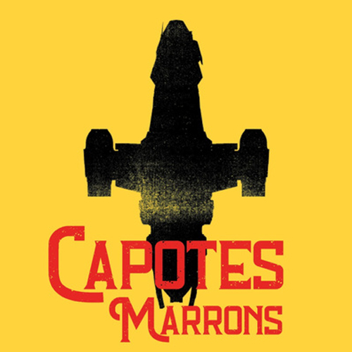

_We understood — better late than never — that Capotes Marrons means something funny in French_

I absolutely love **Firefly**, the 2002 series about cowboys in space. So, to celebrate the series 18th birthday, I got three friends to record a podcast commenting each and every episode from the series — all fourteen of them.

The result is — in portuguese only — _Capotes Marrons_, a free translation of Browncoats.

The podcast is hosted on Anchor and can be listened in a lot of places, like Spotify.

<iframe
  src="https://anchor.fm/capotesmarrons/embed/episodes/Capotes-Marrons-s01e03---Bushwhacked-eje62o"
  frameborder="0"
  scrolling="no"
></iframe>
