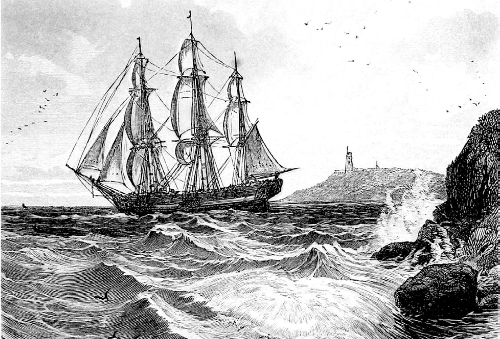
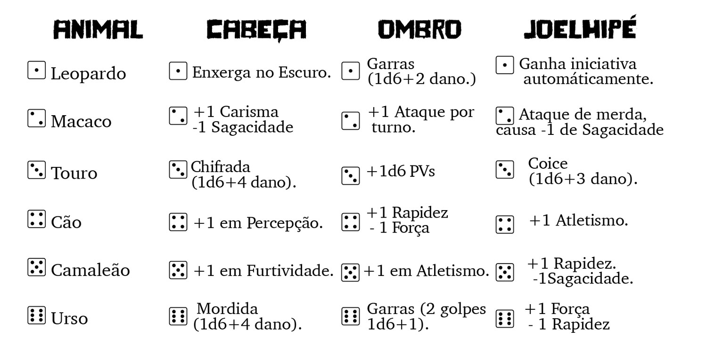
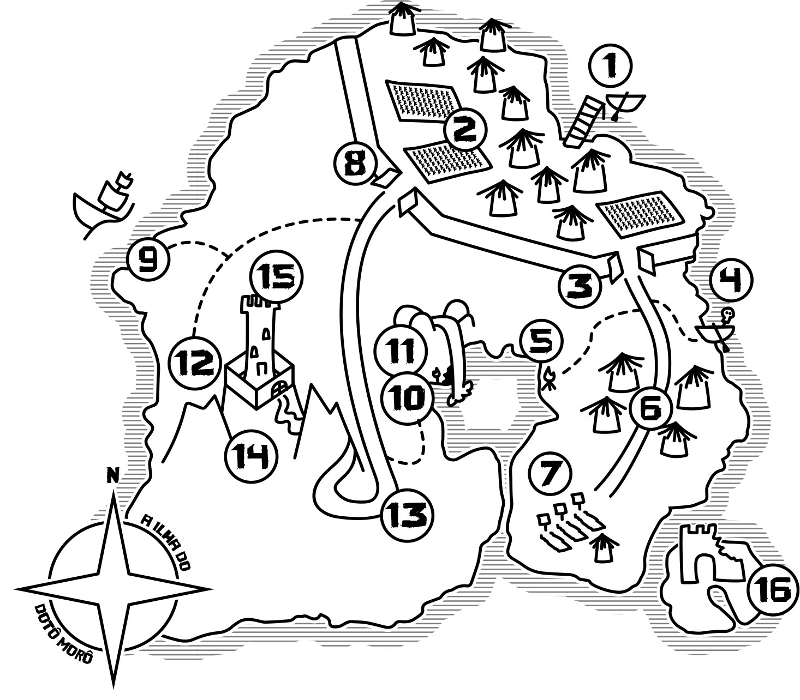
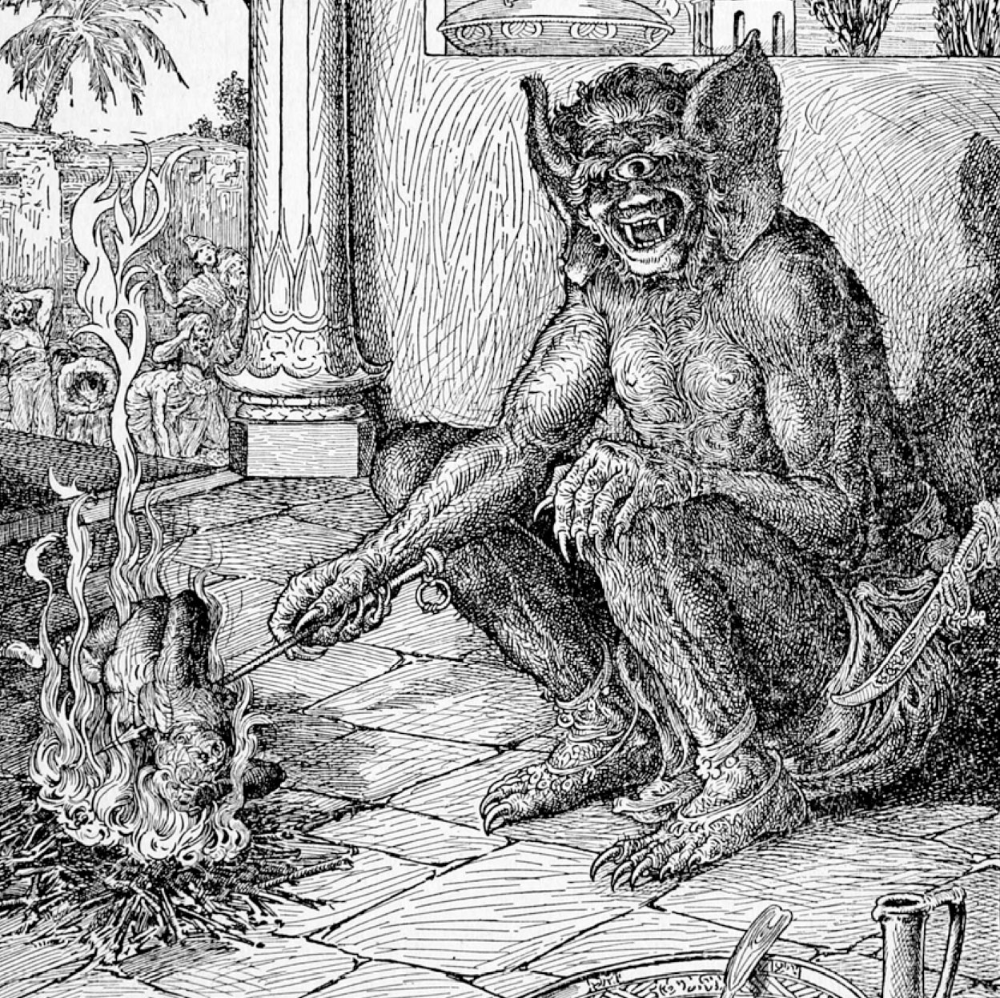

> An animal may be ferocious and cunning enough, but it takes a real man to tell a lie.
>
> _H.G. Wells - The Island of Dr. Moreau_

I wrote this Role Playing Game adventure as extra material for the **hit** Brazilian crowdfunding "[Através das Trevas](https://www.catarse.me/atravesdastrevas)" by Ramon Mineiro — the book hit **almost 300%** of its funding target.

## About

"A Ilha do Dotô Morô" is obviously based on the 1896 book "**The Island of Doctor Moreau**" by H.G. Wells, one of my favorites by him. The book tells the story of a **mad scientist** who modifies animals by vivisection — surgical intervention in **living** subjects — and creates **hybrid** human-and-animal beings.

The book had **several** film adaptations, the first in 1913 and the last (for now) in 1996. This latter version, starred by Val Kilmer and Marlon Brando, is the **big inspiration** for the adventure.

In the movie, the doctor modifies **genomes** instead of **vivisection** — as in the book. In my adventure, the doctor fiddles with **magic**, something deadly and maddening in the _Através das Trevas_ universe, making this quasi-plagiarism even more **bizarre**, grotesque, and gory. It's **fun** for the **whole family**.

## Interesting features

### Create-your-creature

Instead of **countless** hours creating every monster the players could encounter, I did a very efficient **anxiety helper** called _give this responsibility to someone else_. With the help of a **table**, the DM and the players can create **any kind** of crazy mix of animals just by **rolling the dice**. The table can even be used mid-game, so the DM can give the _responsibility to the players_. Lazy people, unite!

With a die for each characteristic — **head**, **shoulders**, **knees & toes** — the players could meet a creature with a leopard head, bear claws, and dog feet — dark-seeing, claw-striking, fast-running — and decide on the spot if they would be **friends** or not.

### Sandbox

The game has **no clear path** set for the players — they can visit whichever area and decide which mystery to solve whenever they want. Depending on their will, they can try to **flee** or even make **friends** with the villain. There's a handy **map** (drawn by me!) to help the DM and the players.

## Making-of

Writing an RPG is **hard**, especially when you are not the one creating the rules — thanks, Ramon, for making such an **easy** rule system.

I didn't want to create a **_closed_ story** for this adventure but let the players **free to roam** Morô's island and find out stuff themselves — decide who they would befriend or attack, which paths to choose and how to approach different situations.

### Free will

With this **sandbox** setting in mind, I started by writing what kinds of characters I wanted the players to meet and which encounters they would have.

Then, I **drew the map** and defined the locations the players could visit. I'm not an illustrator, so the drawing by itself was a **great** experience. All the other illustrations in the book are in the **public domain**.

### Another way

While drawing the map, I created a **simple timeline** of possibilities. The hardest part is knowing the players **will betray** the Dungeon Master and thread the unknown path, so I asked myself multiple times, "how to offer possibilities without **spoiling the fun** and without locking the players in a **single path**?"

I created a possibility/solution table in which I tried to fix the fixable. The rest — **unpredictable** and **unwritten** — is what makes RPGs fun, right?

For instance, the players could try to **leave** the island anytime with a makeshift raft... unless there was a _magic-induced constant rain_ that **prevented** anyone from leaving the island. This feature even added to the **mystery** of "why haven't any of these creatures fled this awful place?"

Another possibility would involve players **not** even wanting to go near the mage — the one responsible for all the **weirdness** on the island, rain included. I didn't entirely solve this by giving them a clear alternative but chose to offer **more reasons** for them to defeat the mage. Instead of mechanics, I chose **emotions**.

All these solutions became interesting **puzzles** and **encounters** with hostile and friendly humans and/or creatures. I also ensured the DM knew they had **complete** control of the adventure and could change the rules as they wished.

## Buy it now

The adventure is available [here](https://dungeonist.com/a-ilha-do-doto-moro/), in Brazilian Portuguese.
